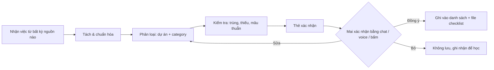
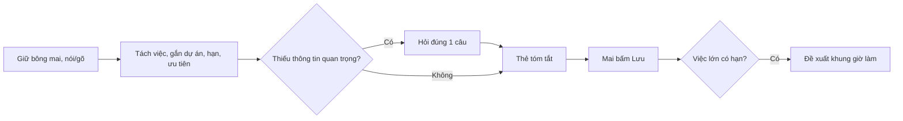
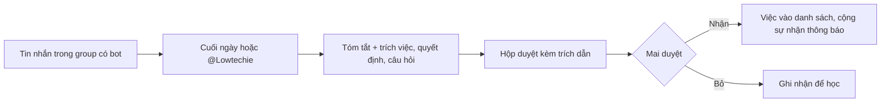
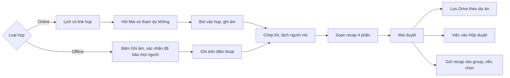
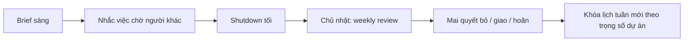

# PRD — Mai Lowtechie: Trợ lý AI Chief of Staff cá nhân & nhóm

*Phiên bản 1.6 — 22/09/2026. Bổ sung: UX/UI, user flow, ghi recap cuộc họp, điều phối thời gian chuẩn bị + di chuyển (mặc định BTS từ ga Bang Na), chuyến đi & checklist bay, nguyên tắc chat/voice cho mọi tính năng, nhập việc từ hình chụp, kiểm tra trước khi lưu và phân loại thông minh theo dự án + category; Học tập là dự án riêng; bỏ Favstay và Edge khỏi danh sách mặc định; Mai tự thêm/sửa dự án và sub category; trích xuất vé máy bay theo thời gian thực, kiểm tra chuyến bay, đính kèm vé; khách hàng/đối tác là trường riêng; sửa và tạo dự án, category, khách hàng ngay trong thẻ duyệt; deadline cho từng việc; Mai tự sắp xếp vị trí dự án, category, khách hàng.*

Tài liệu đi kèm: **Mai Lowtechie — UI & user flow** (mockup màn hình) và **Checklist bay của Mai** (mẫu checklist tick được, dùng làm nguyên mẫu cho module 5.9).

---

## 1. Bối cảnh & vấn đề

Mai vận hành song song nhiều mảng: **Sorene AI** (sản phẩm + gọi vốn), **The Circle Technology** (tư vấn AI tại Bangkok, HCMC, Tokyo), cộng thêm **Học tập** (tiếng Thái và các khóa học) và việc cá nhân (spa, sức khỏe, giấy tờ).

Vấn đề cốt lõi không phải là thiếu công cụ to-do, mà là:

1. **Việc sinh ra ở khắp nơi** — Zalo, WhatsApp, email, cuộc họp, trong đầu — và không ai gom lại.
2. **Chi phí sắp xếp cao** — ghi task, gắn dự án, đặt deadline, xếp lịch đều là việc thủ công.
3. **Không nhìn thấy trade-off** — không biết tuần này thời gian thực sự đổ vào dự án nào, và dự án nào đang bị bỏ đói.
4. **Phối hợp với cộng sự rời rạc** — cam kết trong group chat ("mai em gửi nhé") bị trôi, không ai theo dõi.

## 2. Mục tiêu

| Mục tiêu | Đo bằng |
|---|---|
| Giao việc trong < 10 giây (chat hoặc voice) | Thời gian từ lúc nói đến lúc task được tạo |
| ≥ 80% đầu việc từ group chat được bắt tự động | So sánh với review thủ công hàng tuần |
| Tỷ lệ task trích xuất bị xóa vì sai/không cần < 20% | Precision của triage inbox |
| ≥ 90% việc được xếp đúng dự án + category mà Mai không phải sửa (sau 4 tuần dùng) | Log sửa phân loại |
| Mỗi sáng có brief, mỗi tuần có review | Tỷ lệ mở brief |
| Biết được % thời gian mỗi dự án/tuần | Báo cáo tuần |

**Không phải mục tiêu (v1):** thay thế Notion/Drive làm kho tài liệu; quản lý dự án kiểu Jira cho team lớn; tự động gửi tin nhắn thay Mai mà không duyệt.

## 3. Người dùng

- **Chính: Mai** — founder đa dự án, di chuyển giữa 3 múi giờ (ICT, ICT, JST), dùng tiếng Việt / Thái / Anh, thích nói hơn gõ khi di chuyển.
- **Phụ: cộng sự** — mỗi người có một assistant riêng, cùng chia sẻ không gian dự án chung.

## 4. Use case chính (user stories)

1. *"Nhắc chị gọi cho anh A bên OKR thứ Ba tuần sau, liên quan hợp đồng Circle"* → task gắn dự án Circle, deadline, reminder.
2. *(voice, đang đi taxi)* "Tuần này dời spa sang thứ Năm, và book 2 tiếng deep work cho Sorene pitch deck" → agent đề xuất slot, Mai bấm duyệt, lịch được tạo.
3. Group Zalo "Circle Core" bàn 40 tin nhắn → cuối ngày agent tóm tắt: 3 quyết định, 4 đầu việc (ai làm, hạn khi nào), 2 câu hỏi chưa có ai trả lời.
4. Sáng thứ Hai: "Hôm nay có gì?" → brief: lịch, 3 việc ưu tiên nhất, việc đang chờ người khác, deadline trong 7 ngày.
5. Cộng sự của Circle hỏi assistant của họ: "Mai đã duyệt proposal chưa?" → assistant trả lời từ không gian chung (không lộ việc riêng của Mai).
6. Chủ nhật: weekly review — thời gian đã dùng theo dự án, việc trễ hạn, đề xuất việc nên **bỏ hoặc hoãn**.
7. Họp với khách ở Bangkok (offline) → Mai bấm Ghi âm; 30 giây sau khi kết thúc có recap: quyết định, việc cần làm theo người, câu hỏi bỏ ngỏ.
8. Cuộc gọi Google Meet trong lịch → Lowtechie hỏi trước, vào họp ghi chú, gửi recap để Mai duyệt.

## 5. Yêu cầu chức năng

### 5.0 Nguyên tắc xuyên suốt: mọi thứ làm được bằng chat hoặc voice
Mai có thể ra **mọi** yêu cầu bằng chat (gõ) hoặc voice (nói), bằng tiếng Việt, tiếng Thái, tiếng Anh hoặc trộn lẫn. Không có tính năng nào bắt buộc phải bấm qua nhiều màn hình; giao diện chỉ để xem, duyệt nhanh và chỉnh sửa.

- **Kênh nhận lệnh:** ô chat và nút bông mai (giữ để nói) trong app; bot 1:1 trên Zalo, WhatsApp, Telegram (gõ hoặc gửi voice note); widget màn hình khóa / phím tắt điện thoại để nói ngay không cần mở app.
- **Lệnh nhiều ý trong một câu:** Lowtechie tách thành từng hành động và trình bày lại trong một thẻ tóm tắt.
- **Xác nhận bằng chính kênh đó:** trả lời "ok", "lưu đi", "đổi sang thứ Năm" bằng chat hoặc voice đều được; không bắt mở app để bấm.
- **Phản hồi bằng giọng nói (tùy chọn):** khi Mai dùng voice lúc đang di chuyển, Lowtechie có thể đọc tóm tắt ngắn thay vì chỉ hiển thị chữ.
- **Hỏi lại tối đa một câu** khi thiếu thông tin quan trọng.

**Ví dụ lệnh theo module**
| Module | Chat / voice ví dụ |
|---|---|
| Giao việc | "Thứ Ba nhắc chị gửi báo giá cho OKR, dự án Circle, gấp" |
| Ảnh | *(gửi ảnh checklist)* + "việc của Circle, hạn thứ Sáu" |
| Lịch & di chuyển | "Tối nay 7 giờ hẹn ở Thonglor, đi tàu" / "Mai đi ô tô ra sân bay nhé" |
| Hồ sơ chuẩn bị | "Lần này chỉ cần 30 phút chuẩn bị thôi" |
| Chuyến đi | "Thứ Tư tuần sau chị bay Tokyo 4 ngày" / "Thêm máy uốn tóc vào checklist Tokyo" |
| Group chat | "Hôm nay group Circle Core có gì cần chị xử lý?" |
| Họp | "Ghi âm cuộc họp này" / "Gửi recap cho anh Tuấn" |
| Review | "Tuần này chị dồn thời gian vào đâu?" / "Bỏ việc viết lại trang About" |
| Học tập | "Hôm nay chị học tiếng Thái rồi" / "Tuần này học 4 buổi" |
| Dự án & category | "Tạo dự án Podcast" / "Thêm category Tuyển dụng vào Circle" |
| Deadline | "Hạn thứ Sáu" / "Dời hợp đồng Đô thị sang thứ Hai" / "Việc này không có hạn" |
| Khách hàng / đối tác | "Việc này của khách Đô thị" / "Thêm đối tác OKR vào Circle" / "Cho chị xem hết việc của Đô thị" |
| Cá nhân | "Đặt lịch spa thứ Năm 4 giờ" |

### 5.1 Capture (thu thập)
- Nhập qua: chat trong app, voice note (VI/TH/EN, trộn ngôn ngữ), forward tin nhắn/email vào bot, chia sẻ ảnh chụp màn hình.
- Agent tự tách 1 câu nói thành nhiều task, gắn dự án, người, deadline, ưu tiên.
- Nếu độ tin cậy thấp → hỏi lại **một** câu, không hỏi dồn.

### 5.1.1 Nhập việc từ hình chụp
Mai gửi ảnh, Lowtechie tự trích danh sách việc.

- **Nguồn ảnh:** checklist viết tay trên giấy, bảng trắng sau buổi họp, sticky note, ảnh chụp màn hình (ghi chú điện thoại, tin nhắn, email, file Excel), tài liệu in.
- **Kênh gửi:** chụp trong app, chia sẻ từ thư viện ảnh (share sheet), gửi vào bot Zalo/WhatsApp/Telegram 1:1. Gửi nhiều ảnh một lần được.
- **Ảnh + lời nhắn đi kèm:** gửi ảnh kèm chat hoặc voice, ví dụ "đây là việc của Circle, hạn thứ Sáu", để gắn dự án và hạn cho cả danh sách.
- **Trích xuất:**
  - Từng dòng thành một việc; giữ cấu trúc nhóm/mục con nếu có.
  - Nhận biết ô đã tick / gạch ngang: mục đã xong được đánh dấu xong (hoặc bỏ qua), chỉ mục chưa xong thành việc mới.
  - Đọc ngày, tên người, dấu ưu tiên (*, !, gạch chân, khoanh tròn) nếu có.
  - Tiếng Việt, tiếng Thái, tiếng Anh, kể cả viết trộn.
- **Kết quả vào Hộp duyệt** dưới dạng một nhóm, ảnh gốc đính kèm làm nguồn; Mai nhận cả nhóm, hoặc sửa/bỏ từng dòng.
- **Dòng đọc không chắc** (chữ tay khó đọc, ảnh mờ, lóa) được đánh dấu riêng kèm vùng cắt từ ảnh để Mai xem và sửa nhanh.
- **Biến ảnh thành mẫu:** ảnh một danh sách dùng lặp lại (ví dụ đồ mang theo khi bay) có thể lưu thành mẫu checklist cho module 5.9 thay vì thành việc một lần.
- **Lưu ảnh:** ảnh gốc lưu theo thời hạn (ví dụ 90 ngày) rồi xóa, danh sách việc giữ lâu dài.

Độ khó kỹ thuật: thấp. Mô hình Claude đọc ảnh trực tiếp; phần việc chính là thiết kế bước duyệt và xử lý dòng đọc không chắc.

### 5.2 Task engine
- Trường dữ liệu: tiêu đề, dự án, người phụ trách, deadline (cứng/mềm), ưu tiên, trạng thái, ước lượng thời gian, nguồn (kênh + link/trích đoạn tin nhắn gốc), độ tin cậy.
- **Triage inbox**: mọi task trích xuất tự động vào hàng chờ duyệt trước, swipe để nhận/sửa/bỏ. Task do Mai tự giao đi thẳng vào danh sách.
- Ưu tiên tính theo: deadline, trọng số dự án (Mai đặt, ví dụ Sorene 40%, Circle 30%...), phụ thuộc (đang chặn người khác?), năng lượng cần (deep/shallow).
- Loại đặc biệt: **Waiting-on** (việc đã giao/đang chờ người khác, tự nhắc follow-up), **Routine** (học tiếng Thái hằng ngày, spa định kỳ), **Hard deadline hành chính** (thuế, gia hạn, báo cáo pháp lý).

### 5.2.1 Kiểm tra trước khi lưu & phân loại thông minh
**Nguyên tắc:** không việc nào được ghi vào danh sách hay file checklist (Google Sheets / Notion) khi chưa qua bước kiểm tra và Mai chưa xác nhận. Áp dụng cho mọi nguồn: chat, voice, ảnh, group chat, recap họp, email.

**Luồng**


**1. Tách & chuẩn hóa**
- Một câu nhiều ý thành nhiều việc; mỗi việc bắt đầu bằng động từ rõ ràng ("Gửi báo giá cho OKR", không phải "báo giá OKR").
- Việc quá to hoặc mơ hồ ("làm marketing Circle") → đề xuất tách thành 2–4 việc cụ thể hoặc hỏi lại.

**2. Phân loại vào đúng dự án và category**
- Hai tầng: **Dự án** → **Category**.

| Dự án | Category mặc định |
|---|---|
| Sorene | Sản phẩm · Gọi vốn · Tăng trưởng & cohort · Pháp lý & công ty |
| The Circle Technology | Khách hàng & bán hàng · Delivery dự án · Đào tạo · Marketing & nội dung · Hợp đồng |
| Học tập | Tiếng Thái · Khóa học & chứng chỉ · Đọc & nghiên cứu |
| Cá nhân | Sức khỏe & làm đẹp · Chuyến đi · Nhà cửa · Giấy tờ & tài chính cá nhân |
| Admin chung | Thuế & hạn pháp lý · Hóa đơn · Công cụ & tài khoản |

  Mai thêm, đổi tên, gộp category bằng chat/voice ("tạo category Tuyển dụng cho Circle").
- **Tín hiệu dùng để phân loại:** tên khách hàng/đối tác khớp với danh bạ khách hàng của dự án (kể cả tên gọi tắt, mục 5.3.2); từ khóa và tên riêng khác; nguồn (group chat, email, cuộc họp đã gắn dự án); người liên quan (cộng sự thuộc dự án nào); lịch sử (việc tương tự trước đây Mai xếp vào đâu); lời Mai nói kèm ("việc của Circle").
- **Mỗi việc có độ chắc chắn phân loại.** Dưới ngưỡng → hiện 2 lựa chọn dự án/category có khả năng nhất để Mai chọn một chạm, không đoán bừa.
- **Việc liên quan nhiều dự án:** một dự án chính + gắn tag dự án phụ.
- **Học từ sửa đổi:** mỗi lần Mai đổi dự án/category, hệ thống ghi lại và áp dụng cho lần sau (ví dụ: tên "OKR" luôn là Circle / Khách hàng & bán hàng).

**3. Kiểm tra trước khi lưu**
| Kiểm tra | Xử lý |
|---|---|
| Trùng với việc đã có | Đề xuất gộp, hoặc cập nhật việc cũ thay vì tạo mới |
| Thiếu hạn | Để trống và làm nổi ô Deadline trên thẻ duyệt để Mai tự điền khi nhận; **không tự đoán hạn** (xem 3c) |
| Thiếu người làm với việc cần có | Hỏi một câu |
| Hạn đã qua, rơi vào ngày Mai đang bay, hoặc trùng lịch dày | Cảnh báo và đề xuất ngày khác |
| Mâu thuẫn với việc/quyết định trước | Nêu rõ mâu thuẫn, để Mai chọn |
| Việc đã xong (ô đã tick trong ảnh, đã báo xong trong chat) | Đánh dấu xong, không tạo việc mới |
| Việc phụ thuộc việc khác | Gắn liên kết phụ thuộc |
| Ưu tiên | Gợi ý theo hạn + trọng số dự án; Mai chỉnh được |

**3b. Sửa phân loại ngay trong thẻ duyệt** (lỗi phát hiện khi thử bản prototype 22/9: thẻ duyệt chỉ có một danh sách cố định "Dự án · Category", không sửa hay tạo mới được, và không có chỗ ghi khách hàng)
- Thẻ duyệt có **3 trường riêng**, sửa độc lập:
  1. **Dự án**
  2. **Category** (lọc theo dự án đã chọn)
  3. **Khách hàng / đối tác** (lọc theo dự án đã chọn, không bắt buộc)
  4. **Deadline** (xem 3c)
- Mỗi trường là ô chọn **có tìm kiếm**: gõ vài chữ để lọc; nếu không có kết quả thì hiện dòng **"Tạo mới: …"** để tạo ngay tại chỗ, không phải rời thẻ duyệt.
- Không dùng một danh sách phẳng dài gộp tất cả "Dự án · Category": chọn dự án trước, category sau.
- Đổi tên hoặc xóa category / khách hàng làm ở màn Dự án (mục 5.3.1, 5.3.2); thẻ duyệt chỉ chọn và tạo mới để giữ thao tác nhanh.
- Sửa bằng chat/voice ngay trên thẻ: "việc này của khách Đô thị, category Hợp đồng".
- Mỗi lần Mai sửa, hệ thống ghi nhận để lần sau tự điền đúng (ví dụ: "hợp đồng website" + "Đô thị" → Circle · Hợp đồng · Đô thị).
- Nhóm việc từ ảnh: khi Mai bấm "Nhận cả nhóm", có thể đặt chung dự án / category / khách hàng / deadline cho cả nhóm trước khi nhận.

**3c. Deadline cho từng việc**
- **Mỗi việc có ô Deadline riêng** trên thẻ duyệt, cạnh Dự án / Category / Khách hàng.
- **Có hạn trong nguồn → tự điền.** Ngày tương đối ("thứ Sáu", "tuần sau", "cuối tháng", "trước khi bay") được quy đổi thành ngày cụ thể dựa trên **ngày giờ thực hôm nay và múi giờ của Mai**, và luôn hiện dạng đầy đủ để kiểm tra, ví dụ nguồn ghi "thứ Sáu" → hiện *Thứ Sáu 25/9/2026*. Kèm trích dẫn đoạn gốc chứa hạn.
- **Không có hạn trong nguồn → để trống**, ô Deadline được làm nổi. Lowtechie không tự đoán hạn; Mai tự điền khi nhận việc.
- **Điền nhanh:** nút chọn sẵn *Hôm nay · Ngày mai · Thứ Sáu này · Tuần sau · Cuối tháng*, lịch chọn ngày, hoặc gõ/nói tự do ("thứ Năm 3 giờ chiều", "25/10").
- **Tùy chọn giờ:** mặc định chỉ ngày; thêm giờ khi cần (ví dụ "trước 17:00").
- **Loại hạn:** hạn cứng (khách hàng, pháp lý, chuyến bay) hoặc hạn mềm (tự đặt); hạn cứng hiện nổi bật và được ưu tiên khi xếp lịch.
- **Không có hạn:** Mai có thể chọn rõ "Không có hạn". Nếu bấm "Lưu & nhận" mà ô Deadline vẫn trống, thẻ nhắc một lần "Chưa có deadline — thêm hay để không hạn?" rồi lưu theo lựa chọn.
- **Kiểm tra khi điền:** hạn đã qua, rơi vào ngày Mai đang bay, hoặc ngày đã kín lịch → cảnh báo nhẹ, Mai vẫn giữ được.
- **Sau khi lưu:** hạn đi vào cột Hạn của Google Sheets, xếp ưu tiên, brief sáng ("3 việc đến hạn hôm nay"), nhắc việc (mặc định 1 ngày trước và sáng ngày đến hạn, chỉnh được) và đề xuất khung giờ làm với việc lớn.
- **Đổi hạn sau:** bằng chat/voice ("dời hợp đồng Đô thị sang thứ Hai") hoặc sửa trong danh sách; lịch sử đổi hạn được lưu để weekly review chỉ ra việc bị dời nhiều lần.

**4. Thẻ xác nhận**
- Tóm tắt theo nhóm, ví dụ: *"5 việc mới: 3 Sorene / Gọi vốn, 2 Cá nhân / Chuyến đi. 1 việc trùng (đề xuất gộp), 1 việc thiếu hạn."*
- Mỗi dòng hiện: việc · dự án / category · hạn · người · ưu tiên · độ chắc chắn · nguồn.
- Xác nhận bằng bấm, chat hoặc voice: "ok lưu hết", "việc số 2 chuyển sang Circle", "bỏ việc cuối".
- Chỉ sau xác nhận mới ghi vào file; file ghi thêm cột **Nguồn** và **Ngày tạo** để truy vết.
- **Tự động dần:** khi độ chính xác phân loại của một loại việc đủ cao trong thời gian dài (ví dụ routine cá nhân), Mai có thể bật "lưu thẳng, báo sau" cho riêng loại đó. Mặc định luôn hỏi.

### 5.3 Dự án
- Mỗi dự án có: mục tiêu quý, trọng số thời gian, thành viên, kênh chat liên kết, file liên kết, decision log.
- Dự án mặc định (khớp bảng category ở mục 5.2.1): Sorene, The Circle Technology, **Học tập**, Cá nhân, Admin chung. Đây chỉ là bộ khởi tạo; Mai toàn quyền thay đổi (mục 5.3.1).
- **Học tập** là dự án riêng, có trọng số thời gian và mục tiêu riêng (ví dụ số buổi tiếng Thái mỗi tuần, chuỗi ngày học), hiện riêng trong màn Dự án và Weekly review.

### 5.3.1 Mai tự quản lý dự án & sub category
Danh sách dự án và category không cố định. Mai tự thêm, sửa, sắp xếp bằng **chat, voice** hoặc trong màn **Dự án**.

**Với dự án**
- Thêm mới: tên, màu, biểu tượng, trọng số thời gian/tuần, mục tiêu, thành viên, kênh chat/email liên kết, từ khóa nhận diện (tên khách hàng, đối tác).
- Sửa bất kỳ thuộc tính nào ở trên; đổi tên thì mọi việc, tab Google Sheets và bộ lọc tự cập nhật theo.
- **Lưu trữ** (tạm ngưng): ẩn khỏi Hôm nay và review, giữ nguyên dữ liệu, mở lại được bất cứ lúc nào.
- **Xóa:** bắt buộc chọn việc còn mở sẽ chuyển sang dự án nào hoặc lưu trữ cùng; không bao giờ xóa việc âm thầm.
- **Gộp hai dự án:** việc và category của dự án bị gộp chuyển sang dự án còn lại, category trùng tên được hợp nhất.
- Sắp xếp thứ tự hiển thị (kéo thả hoặc "đưa Học tập lên đầu").

**Với sub category**
- Thêm, đổi tên, xóa, gộp, di chuyển category sang dự án khác.
- Xóa hoặc gộp category → Lowtechie hỏi việc thuộc category đó chuyển về đâu trước khi thực hiện.
- Đặt mặc định cho từng dự án (việc chưa rõ category rơi vào đâu).

**Sắp xếp vị trí (dự án, category, khách hàng)**
- Mai tự quyết thứ tự ở **cả hai tầng**: thứ tự các dự án, và thứ tự category bên trong từng dự án. Danh bạ khách hàng của mỗi dự án cũng sắp xếp được.
- **Trong app:** màn Dự án có chế độ "Sắp xếp"; kéo thả bằng tay nắm ở đầu mỗi dòng. Có thêm nút Lên đầu / Xuống cuối cho thao tác một chạm.
- **Chuyển tầng / chuyển chỗ:** kéo một category sang dự án khác để chuyển nó (việc bên trong đi theo, Lowtechie xác nhận trước khi chuyển).
- **Bằng chat/voice:** "đưa Học tập lên đầu", "cho Hợp đồng lên trên Khách hàng & bán hàng trong Circle", "Đào tạo xuống cuối".
- **Thứ tự của Mai được dùng ở mọi nơi:** ô chọn trong thẻ duyệt, màn Hôm nay và Dự án, weekly review, thứ tự tab trong Google Sheets và thứ tự nhóm category trong mỗi tab.
- Ô chọn trong thẻ duyệt có thể thêm một mục nhỏ "Dùng gần đây" ở trên cùng, nhưng phần danh sách chính luôn giữ đúng thứ tự Mai đặt; Lowtechie không tự đảo thứ tự.
- Việc mới tạo (dự án, category, khách hàng) được thêm vào cuối danh sách; Mai kéo lên nếu muốn.
- Thay đổi thứ tự hoàn tác được.

**Lowtechie gợi ý nhưng không tự đổi cấu trúc**
- Khi có nhiều việc không khớp category nào, hoặc Mai hay sửa một kiểu → đề xuất tạo category mới ("Có 6 việc về tuyển dụng ở Circle, tạo category Tuyển dụng không?").
- Dự án không có hoạt động 30 ngày → hỏi có muốn lưu trữ không.
- Mọi thay đổi cấu trúc đều cần Mai xác nhận, và có thể hoàn tác.

**Ví dụ lệnh**
| Mai nói / gõ | Lowtechie làm |
|---|---|
| "Tạo dự án mới tên Podcast, màu cam, 3 tiếng mỗi tuần" | Tạo dự án, hỏi có muốn thêm category không |
| "Thêm category Tuyển dụng vào Circle" | Thêm category |
| "Đổi tên Admin chung thành Hành chính" | Đổi tên dự án, cập nhật file |
| "Gộp Khóa học với Đọc & nghiên cứu" | Hỏi tên category sau khi gộp, chuyển việc |
| "Tạm ngưng dự án Podcast" | Lưu trữ dự án |
| "Đưa Hợp đồng lên đầu trong Circle" | Đổi vị trí category, cập nhật thứ tự ở mọi màn và trong file |

### 5.3.2 Khách hàng & đối tác
Circle (và các dự án khác) có nhiều khách hàng và đối tác. **Khách hàng/đối tác là một trường riêng, không phải category.** Category trả lời "đây là loại việc gì" (Hợp đồng, Delivery, Đào tạo…); khách hàng trả lời "việc này cho ai". Nếu biến mỗi khách hàng thành một category, số category sẽ nhân lên theo số khách hàng và không còn lọc được theo loại việc.

Ví dụ: *"Ký lại hợp đồng website"* → **Circle · Hợp đồng · Khách hàng: Đô thị**.

**Danh bạ khách hàng/đối tác theo dự án**
- Mỗi mục gồm: tên, loại (khách hàng / đối tác / nhà cung cấp), tên gọi tắt và cách gọi khác (ví dụ "Đô thị", tên công ty đầy đủ, tên người liên hệ), người liên hệ, trạng thái (đang làm / tiềm năng / đã kết thúc), group chat và email liên kết, ghi chú.
- Một khách hàng có thể thuộc nhiều dự án (ví dụ vừa là khách của Circle vừa là đối tác của Sorene).
- Mai thêm, sửa, gộp (khi trùng tên), lưu trữ bằng chat, voice, màn Dự án, hoặc tạo nhanh ngay trong thẻ duyệt.

**Nhận diện tự động**
- Khi trích việc, Lowtechie so tên trong nội dung với danh bạ (kể cả tên gọi tắt) để điền khách hàng.
- Gặp tên chưa có trong danh bạ → đề xuất "Tạo khách hàng mới 'Đô thị' cho Circle?" thay vì bỏ trống hoặc đoán.
- Việc đến từ group chat/email đã gắn với một khách hàng → tự điền khách hàng đó.

**Xem theo khách hàng**
- Màn chi tiết khách hàng: tất cả việc (mở và đã xong) theo category, việc đang chờ phía khách, lần liên hệ gần nhất, recap các cuộc họp với khách, hợp đồng và file liên quan.
- Hỏi bằng chat/voice: "Đô thị đang còn việc gì?", "Tuần này có khách nào chưa được follow-up?".
- Weekly review có thể xem thời gian theo khách hàng của Circle, không chỉ theo dự án.

### 5.4 Calendar agent
- Đọc/ghi Google Calendar.
- Tìm slot trống có tính múi giờ, thời gian di chuyển, và "vùng bảo vệ" (deep work, nghỉ).
- **Time-blocking**: tự đặt block cho task lớn trước deadline.
- **Mọi hành động ghi lịch đều cần Mai bấm duyệt** ở v1; cho phép tự động hóa dần theo từng loại (ví dụ: routine cá nhân được tự đặt).
- Đặt lịch với người khác: soạn tin đề xuất giờ, Mai duyệt trước khi gửi.

### 5.4.1 Điều phối thời gian: chuẩn bị + di chuyển
Mục tiêu: Mai chỉ cần nói "hẹn 19:00 ở Thonglor" hoặc "bay 10:30 từ Suvarnabhumi", Lowtechie tự tính ngược và khóa lịch để biết **khi nào bắt đầu chuẩn bị** và **khi nào phải đi**.

**Tính ngược từ giờ hẹn**
```
Giờ hẹn 19:00 (Thonglor)
  − đệm đến sớm (10 phút)
  − di chuyển (Google Maps, giao thông dự báo lúc 18:xx, mô hình "ngày xấu")
  − đệm rời nhà (10 phút: thang máy, gọi xe)
  − chuẩn bị (1 tiếng 30: tắm + make up)
  = giờ bắt đầu chuẩn bị
```
Kết quả trên lịch: 3 block liên tiếp, **Chuẩn bị** → **Di chuyển** → **Cuộc hẹn**, màu nhạt hơn cuộc hẹn chính, đánh dấu "bận".

**Hồ sơ chuẩn bị (Mai tự đặt, dùng lại)**
| Loại | Thời gian | Khi nào áp dụng |
|---|---|---|
| Ra ngoài đầy đủ (tắm + make up) | 1 tiếng 30 | Hẹn gặp trực tiếp, sự kiện |
| Ra ngoài nhanh | 30 phút | Cà phê gần nhà, spa |
| Họp online có quay mặt | 20 phút | Họp video với khách |
| Không cần chuẩn bị | 0 | Việc cá nhân, họp chỉ audio |
Lowtechie gợi ý hồ sơ theo loại sự kiện; Mai đổi bằng một chạm.

**Sân bay**
- Chuyến bay có block riêng: chuẩn bị + di chuyển + **đệm sân bay** (mặc định 2 tiếng 30 cho bay quốc tế, 1 tiếng 30 nội địa; Mai chỉnh được theo sân bay, có hành lý ký gửi hay không, có fast track hay không).
- Đọc email xác nhận vé (Gmail) để lấy giờ bay, sân bay, nhà ga; giờ bay luôn lưu theo múi giờ địa phương của sân bay đi/đến.
- Đổi giờ bay → cả chuỗi block tự dời theo.

**Địa điểm & điểm xuất phát**
- Lưu các địa điểm quen: Nhà (Bangkok), Nhà (HCMC), khách sạn khi ở Tokyo, văn phòng.
- Điểm xuất phát = nơi Mai ở ngay trước đó trên lịch (nếu có cuộc hẹn trước), không mặc định là nhà. Hai cuộc hẹn liền nhau thì tính đường giữa hai nơi.
- Hỏi lại khi địa điểm mơ hồ ("Thonglor" là cả một khu → xin tên quán hoặc dùng điểm giữa khu, ghi chú rõ).

**Phương tiện: mặc định tàu điện**
- Ở Bangkok, Lowtechie **mặc định tính theo tàu điện (BTS)**. Chỉ tính theo ô tô khi Mai nói rõ ("tối nay đi ô tô", "book Grab").
- **Tuyến quen từ nhà:** Nhà (Bangkok) → đi bộ → **BTS Bang Na** → tàu → ga gần điểm hẹn → đi bộ đến nơi.
- **Thời gian đi bộ nhà → BTS Bang Na:** Google Maps tính một lần từ địa chỉ nhà đã lưu (chế độ đi bộ), Mai xem và chỉnh nếu thực tế khác (ví dụ tính cả thang máy, lên ga). Lưu lại, không gọi API mỗi lần.
- **Chuỗi tính ngược khi đi tàu:**
```
Giờ hẹn
  − đệm đến sớm (10 phút)
  − đi bộ từ ga xuống đến nơi hẹn (Google Maps)
  − thời gian tàu + đổi tuyến nếu có (Google Maps, chế độ phương tiện công cộng)
  − đệm chờ tàu / qua cổng (5 phút)
  − đi bộ nhà → BTS Bang Na (giá trị đã lưu)
  − đệm rời nhà (10 phút)
  − chuẩn bị (theo hồ sơ)
  = giờ bắt đầu chuẩn bị
```
- Với phương tiện công cộng, Google Maps cho phép nhập thẳng **giờ muốn đến**, nên phép tính gọn và chính xác hơn so với ô tô.
- **Trời mưa:** nếu dự báo mưa vào giờ đi, cộng thêm đệm cho đoạn đi bộ (mặc định +10 phút) và nhắc mang ô.
- **Khi tàu điện không hợp lý** (ví dụ sân bay Suvarnabhumi phải đổi nhiều tuyến, hoặc điểm hẹn cách ga quá xa để đi bộ): Lowtechie vẫn tính theo tàu, nhưng hiện thêm phương án ô tô bên cạnh để Mai chọn; không tự đổi.
- Ở HCMC và Tokyo: phương tiện mặc định đặt riêng cho từng thành phố.

**Cảnh báo "đến giờ"**
- Thông báo lúc bắt đầu chuẩn bị, và lúc phải đi (kèm link mở Google Maps chỉ đường).
- 45–60 phút trước giờ đi, kiểm tra lại giao thông thực tế; nếu chậm hơn dự kiến > 10 phút → báo "đi sớm hơn 15 phút" và dời block.
- Xung đột (chuẩn bị chồng lên cuộc họp trước) → cảnh báo ngay lúc đặt lịch, đề xuất dời hoặc chuẩn bị rút gọn.

**Giới hạn cần biết**
- Google Maps Routes API cho phép chọn giờ **đến** chỉ với phương tiện công cộng (đúng với lựa chọn mặc định BTS của Mai); với ô tô chỉ nhập được giờ **đi**, nên khi Mai đi ô tô hệ thống phải thử vài giờ đi và chọn giờ muộn nhất vẫn đến kịp.
- Cần kiểm tra chất lượng dữ liệu lịch tàu BTS/MRT trên Google Maps bằng vài chuyến thật trước khi tin hoàn toàn.
- Dự báo giao thông nhiều ngày trước chỉ là ước lượng lịch sử; con số chính xác nhất là lần kiểm tra lại trước giờ đi.
- Không lấy được thời gian chờ Grab thực tế qua API; dùng đệm cố định.

### 5.5 Ingest group chat (Zalo / WhatsApp)
- Đọc tin nhắn các group được cho phép (allowlist), tóm tắt theo lịch (cuối ngày hoặc khi có `@bot`).
- Trích xuất: đầu việc, người nhận, hạn, quyết định, câu hỏi bỏ ngỏ, cam kết ngầm ("để em lo").
- Lưu kèm trích dẫn gốc để kiểm chứng.
- Xem mục 8 về giới hạn kỹ thuật — **đây là phần rủi ro nhất của sản phẩm.**

### 5.6 Không gian chung & assistant của cộng sự
- Mô hình quyền 3 lớp: **Riêng tư** (chỉ Mai) / **Dự án** (thành viên dự án) / **Công khai trong team**.
- Mỗi cộng sự có assistant riêng, truy vấn được dữ liệu cấp Dự án họ tham gia.
- Giao việc chéo: assistant của Mai tạo task cho cộng sự → xuất hiện trong inbox của họ để nhận/từ chối.
- v1 dùng **một hệ thống, nhiều người dùng** (shared database + phân quyền), không làm giao thức agent-nói-chuyện-với-agent — đơn giản và an toàn hơn nhiều.

### 5.7 Xuất ra file
- Chỉ ghi vào file sau bước xác nhận ở mục 5.2.1.
- Cấu trúc file checklist (Google Sheets): một tab mỗi dự án + một tab "Tất cả". Cột: Dự án · Category · Khách hàng/Đối tác · Việc · Người làm · Hạn · Ưu tiên · Trạng thái · Nguồn · Ngày tạo · Ghi chú. Lọc và nhóm theo category hoặc theo khách hàng có sẵn.
- Đồng bộ task sang Google Sheets (một tab / dự án) và/hoặc Notion — để cộng sự không dùng app vẫn xem được.
- Ghi chú & biên bản họp lưu vào Google Drive theo thư mục dự án.

### 5.8 Họp & recap
- **Họp online (Google Meet, Zoom, Teams):** Lowtechie đọc lịch, thấy sự kiện có link họp thì hỏi trước "Mình tham dự ghi chú nhé?". Nếu Mai đồng ý, một bot tham gia cuộc họp như một thành viên có tên "Mai Lowtechie (ghi chú)", ghi âm, chép lời theo từng người nói.
- **Họp offline:** nút Ghi âm trong app; trước khi ghi phải xác nhận đã báo cho người tham dự. Ghi được khi màn hình tắt, tải lên theo đoạn để không mất dữ liệu khi mạng yếu.
- **Upload file:** thả file ghi âm/ghi hình có sẵn để làm recap.
- **Recap theo mẫu cố định:** Tóm tắt (3–5 câu), Quyết định, Việc cần làm (người + hạn), Câu hỏi bỏ ngỏ, Trích đoạn quan trọng có mốc thời gian.
- Việc cần làm vào Hộp duyệt; recap lưu vào Google Drive theo thư mục dự án; Mai chọn có gửi recap vào group Zalo/WhatsApp hay email cho người tham dự không.
- Ngôn ngữ: tiếng Việt, tiếng Thái, tiếng Anh và câu trộn; recap xuất theo ngôn ngữ Mai chọn.
- Chuẩn bị trước họp: 30 phút trước giờ họp gửi brief về người/công ty, lần gặp trước, việc còn treo.

### 5.9 Chuyến đi & checklist bay
Mục tiêu: mỗi chuyến bay tự có kế hoạch chuẩn bị, Mai không phải nhớ gì.

**Tạo chuyến đi**
- Tự động khi Lowtechie đọc được email xác nhận vé (Gmail), hoặc khi Mai nói/gõ ("Thứ Tư tuần sau chị bay Tokyo 4 ngày").
- Một chuyến gồm: điểm đến, giờ bay đi/về (theo múi giờ địa phương), nơi ở, mục đích (gặp khách / cá nhân), ai đi cùng.

**Trích xuất vé máy bay (bắt buộc đúng ngày, đúng chuyến)**

*Lỗi đã gặp khi thử:* hôm nay là 22/9 nhưng hệ thống lấy một chuyến có ngày bay trước 22/9. Nguyên nhân gốc: mô hình AI không tự biết "hôm nay" là ngày nào. Nếu không được cung cấp ngày giờ thực, nó sẽ đoán, hoặc chọn nhầm chuyến cũ trong email/PDF có nhiều chặng hay lịch sử đổi vé. Các yêu cầu dưới đây sửa lỗi này.

*1. Mốc thời gian thực*
- Mọi lần trích xuất đều được cấp: ngày giờ hiện tại từ máy chủ, múi giờ và thành phố Mai đang ở (Bangkok / HCMC / Tokyo). Không bao giờ để AI tự đoán ngày.
- Vé chỉ ghi ngày không ghi năm (ví dụ "22SEP") → năm được suy ra là lần gần nhất **từ hôm nay trở đi**, và kiểm tra chéo với ngày xuất vé.
- So sánh "đã bay chưa" theo **giờ địa phương của sân bay đi**, không theo giờ điện thoại.

*2. Chọn đúng chuyến*
- Một vé/email có thể chứa: chặng đi và chặng về, chuyến cũ đã bay, lịch trình trước khi đổi, chặng đã hủy.
- Quy tắc: chỉ lấy chặng có giờ khởi hành **sau thời điểm hiện tại**; chặng đã bay được ghi là "đã bay" và không tạo nhắc việc; nếu có nhiều phiên bản lịch trình, lấy phiên bản mới nhất (theo ngày cập nhật/xuất vé); bỏ chặng có trạng thái hủy.
- Khứ hồi mà chặng đi đã qua → chỉ tạo lịch và checklist cho chặng về.
- Nếu không có chặng nào trong tương lai → báo rõ "Vé này là chuyến đã bay (15/9)", không tạo gì.

*3. Thông tin phải trích*
Mã đặt chỗ (PNR) · số vé điện tử · tên hành khách · hãng + số hiệu chuyến · sân bay đi/đến (mã IATA, tên, nhà ga) · giờ đi và giờ đến theo **giờ địa phương** kèm múi giờ (có dấu "+1 ngày" nếu đến hôm sau) · hạng vé · số ghế · hành lý xách tay/ký gửi · giờ mở check-in online · giờ đóng quầy / giờ lên máy bay nếu có.

*4. Kiểm tra trước khi lưu* (theo nguyên tắc 5.2.1)
- Ngày bay ≥ hôm nay; giờ đến sau giờ đi sau khi quy đổi múi giờ; thời gian bay hợp lý với tuyến; mã sân bay hợp lệ.
- Đối chiếu số hiệu chuyến với dữ liệu lịch bay của một dịch vụ dữ liệu chuyến bay; lệch giờ hoặc lệch sân bay → cảnh báo.
- Trùng với chuyến đã lưu (cùng PNR) → cập nhật chuyến cũ, không tạo bản sao.
- **Thẻ xác nhận luôn hiện dòng mốc thời gian**, ví dụ: *"Hôm nay: Thứ Ba 22/9/2026, giờ Bangkok. Đã chọn: [số hiệu], BKK → HND, Thứ Tư 30/9 22:35 → Thứ Năm 1/10 06:50 (+1). Bỏ qua: chặng 15/9 (đã bay)."* Mai thấy ngay nếu hệ thống chọn sai.
- Mai sửa bằng chat/voice ("không phải chuyến này, lấy chuyến ngày 30").

*5. Sau khi lưu*
- Tạo sự kiện Google Calendar đúng múi giờ từng đầu (giờ đi theo giờ nơi đi, giờ đến theo giờ nơi đến).
- Kích hoạt chuỗi chuẩn bị → di chuyển → đệm sân bay (5.4.1) và checklist theo điểm đến.
- **Theo dõi chuyến bay thời gian thực** từ 24 giờ trước giờ bay: trễ, đổi cổng, đổi nhà ga, hủy → báo Mai và tự dời chuỗi lịch.

*6. Đính kèm vé*
- Lưu file gốc (PDF, ảnh, email) vào chuyến đi trong app và vào thư mục Drive theo chuyến; gắn link vào sự kiện lịch.
- Màn chuyến đi có nút **Mở vé** một chạm, xem được **khi không có mạng**; boarding pass có mã QR hiện ở chế độ sáng tối đa.
- Nhiều file cho một chuyến (vé, boarding pass, xác nhận khách sạn, bảo hiểm) được gom chung.
- Vé chứa thông tin cá nhân → lưu mã hóa, chỉ Mai xem (không chia sẻ sang không gian dự án), tự xóa sau khi chuyến kết thúc một thời gian (ví dụ 90 ngày), trừ khi Mai chọn giữ.

*6b. Quy tắc kỹ thuật rút ra từ lỗi thật (vé OADC5J, 22/9)*
Lỗi: vé khứ hồi có 2 chặng (VU-130 BKK → SGN 7/9 đã bay; VU-131 SGN → BKK 2/10 sắp tới). App bỏ qua đúng chặng 7/9 nhưng không trích chặng 2/10, và màn Chuyến đi vẫn hiện chuỗi ngày bay 7/9.
- **Trích theo chặng, không theo vé:** AI trả về một **mảng tất cả các chặng** trong email và mọi file đính kèm; một mã đặt chỗ (PNR) có thể có nhiều chặng. Khóa gộp/khử trùng là PNR + số hiệu + ngày bay, không bao giờ chỉ là PNR.
- **Đọc cả file đính kèm:** PDF xác nhận vé thường chứa đầy đủ hành trình hơn nội dung email.
- **Lọc bằng code, không để AI lọc:** AI chỉ trích dữ liệu thô (kèm giờ địa phương và múi giờ sân bay); việc so với "bây giờ" và gán trạng thái sắp tới / đã bay do code làm, có thể kiểm thử.
- **Đổi giờ tính theo từng chặng:** email đổi lịch cập nhật đúng chặng bị đổi, không ghi đè cả vé; chặng chưa có email đổi lịch giữ giờ trong vé và được đối chiếu với dữ liệu lịch bay.
- **Giao diện chỉ dựng từ chặng "sắp tới":** tab chuyến, chuỗi ngày bay và checklist không bao giờ hiện chặng đã bay; chặng đã bay nằm trong mục "Lịch sử".
- **Nhãn hướng bay rõ ràng:** "Cất cánh BKK → SGN", không phải "Cất cánh HCMC".
- **Điểm xuất phát theo thành phố của chặng:** chặng về từ SGN tính đường từ nơi ở tại HCMC, không phải từ nhà ở Bangkok.
- **Giờ có mặt tại sân bay** lấy theo quy định ghi trên vé nếu có (vé OADC5J: có mặt tại quầy ít nhất 2 tiếng trước giờ bay quốc tế), cộng đệm của Mai.

*7. Bộ test bắt buộc trước khi phát hành*
- **Test hồi quy OADC5J:** với "hôm nay" = 22/9/2026 17:47 giờ Bangkok, kết quả phải là đúng 1 chặng sắp tới: VU-131, SGN (nhà ga 2) → BKK, Thứ Sáu 2/10/2026 11:50 → 13:25, ghế 12F, hành lý ký gửi 15kg; chặng VU-130 7/9 nằm trong Lịch sử; màn Chuyến đi hiện tab "Về Bangkok · 2/10".

Vé khứ hồi đã bay chặng đi · email đổi vé (cũ + mới) · vé không ghi năm · chuyến qua nửa đêm (+1) · bay qua múi giờ (BKK → Tokyo) · chuyến đã hủy · PDF nhiều hành khách · ảnh chụp màn hình vé trong app hãng · vé tiếng Thái / tiếng Việt / tiếng Anh. Mỗi test chạy với nhiều ngày "hôm nay" khác nhau.

**Checklist đồ mang theo** (mẫu gốc: trang "Checklist bay của Mai")
- Nhóm: Giấy tờ · Công nghệ & làm việc · Tiền & thẻ · Làm đẹp & cá nhân · Quần áo · Sức khỏe & trên máy bay.
- **Mẫu theo điểm đến:** Tokyo (Visit Japan Web, tiền mặt yên, thẻ Suica/Pasmo, giày đi bộ), HCMC (tiền đồng), về Bangkok (TDAC nếu áp dụng, baht đi taxi). Mẫu mở rộng được cho điểm đến mới.
- **Theo ngữ cảnh chuyến:** có lịch gặp khách → thêm bộ đồ gặp khách, danh thiếp, tài liệu offline; theo dự báo thời tiết → áo mưa/áo ấm; theo độ dài chuyến → số bộ quần áo.
- Mai thêm/xóa món bằng chat, voice hoặc trong app; món tự thêm được học và giữ cho các chuyến sau cùng điểm đến.
- Nhắc riêng các quy định hay quên: chất lỏng xách tay tối đa 100ml mỗi chai, pin dự phòng không ký gửi.

**Việc trước khi bay: tự đặt thành task có mốc thời gian**
| Mốc | Việc |
|---|---|
| 1 tuần trước | Kiểm tra hộ chiếu (còn ≥ 6 tháng) và yêu cầu nhập cảnh; đặt nơi ở; bảo hiểm; eSIM; báo cộng sự lịch vắng; dời/chuyển online các cuộc họp trùng ngày bay; đặt spa/làm tóc nếu muốn |
| 3 ngày trước | Tờ khai nhập cảnh điện tử theo điểm đến (Visit Japan Web; TDAC trong vòng 3 ngày trước khi đến Thái Lan, chỉ dùng trang chính thức https://tdac.immigration.go.th, miễn phí; Lowtechie gửi kèm link này trong nhắc việc); xem thời tiết; giặt đồ; đổi tiền; tải bản đồ và tài liệu offline; check-in online |
| Tối hôm trước | Sạc thiết bị; xếp hành lý theo checklist; cân hành lý; kiểm tra giờ bay và nhà ga; đặt xe; thanh toán hóa đơn sắp đến hạn; bật trả lời tự động email nếu đi dài ngày |
| Sáng ngày bay | Kiểm tra hộ chiếu, điện thoại, ví; kiểm tra chuyến bay có đổi giờ; tắt điện, bình nóng lạnh, điều hòa; đổ rác, tưới cây; khóa cửa |
| Ở sân bay | Có mặt trước 2 tiếng 30 (quốc tế); nhắn giờ đến cho người đón/cộng sự |

**Kết nối với các module khác**
- Chuỗi lịch ngày bay dùng module 5.4.1: Chuẩn bị (hồ sơ 1 tiếng 30) → Di chuyển ra sân bay → Đệm sân bay → Chuyến bay. Riêng sân bay, Lowtechie hiện thêm phương án ô tô bên cạnh phương án tàu.
- Tối hôm trước, brief buổi tối chuyển thành "brief chuyến bay": giờ phải dậy, giờ phải đi, những món còn chưa tick.
- Ngày về: tự tạo việc "gửi recap chuyến đi / follow-up khách đã gặp".
- Yêu cầu nhập cảnh thay đổi theo quốc tịch và theo thời gian; Lowtechie luôn nhắc kiểm tra trang chính thức, không khẳng định thay.

### 5.10 Briefing & review
- **Brief sáng** (qua app + đẩy sang Zalo/WhatsApp/Telegram): lịch, top 3, chờ người khác, deadline 7 ngày.
- **Shutdown tối**: việc xong, việc dời, nhắc chuẩn bị cho mai.
- **Weekly review**: thời gian theo dự án vs trọng số mục tiêu, việc trễ, đề xuất cắt/hoãn, cam kết chưa ai giữ.

## 6. UX/UI

### 6.1 Thương hiệu
- **Tên:** Mai Lowtechie. Ý tưởng: công nghệ cao nhưng dùng như không cần biết công nghệ.
- **Linh vật:** bông hoa mai năm cánh có mặt cười. Bông mai đồng thời là nút giao việc ở giữa thanh điều hướng, và "nở" khi đang nghe.
- **Tính cách:** smart, dễ thương nhưng không trẻ con; vui vẻ nhưng nói thẳng khi Mai ôm quá nhiều việc.
- **Màu:** vàng mai `#FFC93C` cho hành động chính, mực chàm `#1E2150` cho chữ và dữ liệu, nền sương `#EEF1F8`, má hồng `#FF8FA3` điểm xuyết, xanh lá `#2FA97C` chỉ dành cho "đã xong". Mỗi dự án một màu cố định: Sorene tím, Circle xanh ngọc, Học tập xanh cốm `#9BC53D`, Cá nhân hồng, Admin chung xám `#8A8FB0`. Dự án Mai tự thêm được chọn màu từ bảng màu có sẵn.
- **Chữ:** Baloo 2 (tiêu đề, con số, lời của Lowtechie), Be Vietnam Pro (nội dung, hiển thị dấu tiếng Việt tốt). Cần kiểm tra thêm hiển thị tiếng Thái; dự phòng Noto Sans Thai.
- **Giọng:** xưng "mình", gọi "Mai"; mỗi lần hỏi một câu; đề xuất kèm lý do, không ra lệnh.
- Hỗ trợ chế độ tối ngay từ đầu.

### 6.2 Kiến trúc thông tin
Thanh điều hướng 5 mục: **Hôm nay** · **Dự án** · **Bông mai** (giao việc: giữ để nói, chạm để gõ) · **Lịch** · **Hộp duyệt**. Họp, Weekly review và Cài đặt mở từ Hôm nay hoặc ảnh đại diện.

### 6.3 Màn hình chính
| Màn hình | Mục đích | Thành phần chính |
|---|---|---|
| Hôm nay | Biết ngay nên làm gì | Lời chào + một đề xuất có nút bấm, top 3, việc chờ người khác, lịch trong ngày |
| Giao việc | Nói một câu thành nhiều việc | Sóng âm, lời chép trực tiếp, thẻ việc đã tách, Lưu cả hai / Sửa |
| Hộp duyệt | Kiểm soát việc tự trích | Thẻ vuốt (bỏ / sửa / nhận), nguồn, trích dẫn gốc, độ chắc chắn |
| Dự án | Thấy phân bổ thời gian | Vòng tiến độ thời gian thật so với mục tiêu, cảnh báo dự án bị bỏ đói |
| Lịch | Đặt giờ có kiểm soát | 3 khung đề xuất kèm lý do, ghi chú múi giờ, nút đặt |
| Họp | Ghi và recap | Thanh ghi âm, recap 4 phần, Lưu việc / Gửi recap |
| Chuyến đi | Không quên gì khi bay | Checklist tick được theo điểm đến, việc trước khi bay theo mốc, chuỗi lịch ngày bay |
| Weekly review | Giúp nói "không" | Biểu đồ thời gian vs mục tiêu, việc dời nhiều lần, Bỏ / Giao / Hoãn |

### 6.4 User flow chính

**Giao việc nhanh**


**Group chat thành việc**


**Recap cuộc họp**


**Nhịp ngày và tuần**


### 6.5 Nguyên tắc UX
0. Màn hình không có câu giải thích cách hoạt động hay tham chiếu nội bộ (ví dụ "PRD §5.2"). Hộp duyệt chỉ có tiêu đề, bộ đếm và thẻ việc; hướng dẫn chỉ hiện một lần ở lần dùng đầu tiên.
1. Giao một việc không bao giờ quá 10 giây, bằng chat hoặc voice, từ bất kỳ kênh nào.
2. Duyệt trước, tự động sau: mở tự động dần cho từng loại hành động khi độ chính xác đủ cao.
3. Mọi việc tự trích đều có nguồn gốc (tin nhắn hoặc đoạn ghi âm).
3b. Không lưu gì khi chưa kiểm tra và chưa được Mai xác nhận; phân loại sai thì sửa một chạm và hệ thống nhớ.
4. Dễ thương nhưng thật thà: nói thẳng khi quá tải.

## 7. Kiến trúc đề xuất

```
[Giao diện]  PWA mobile (chat + voice)  |  Bot Telegram/Zalo/WhatsApp 1:1
        │
[Agent layer]  Claude API (tool use) — router → các tool: task, calendar, project, search, file
        │
[Dữ liệu]  Supabase: Postgres + Auth + Row-Level Security + pgvector (tìm lại ngữ cảnh)
        │
[Jobs]  Scheduler (cron / Trigger.dev / Inngest): brief, tóm tắt group, follow-up
        │
[Tích hợp]  Google Calendar · Google Drive/Sheets · Gmail · Zalo · WhatsApp · Speech-to-text
```

Ghi chú lựa chọn:
- **Ngữ cảnh thời gian thực cho mọi lời gọi AI:** ngày giờ hiện tại, múi giờ và thành phố Mai đang ở được đưa vào mọi yêu cầu (trích xuất vé, đặt lịch, phân loại hạn). Đây là yêu cầu bắt buộc, không phải tùy chọn.
- **Row-Level Security** của Postgres giải quyết phần phân quyền Riêng tư / Dự án / Team ngay từ tầng dữ liệu — đừng để LLM tự quyết ai được xem gì.
- **Speech-to-text** cần test thật với tiếng Việt, tiếng Thái và câu trộn tiếng Anh trước khi chọn nhà cung cấp.
- Mọi hành động có tác động ra ngoài (ghi lịch, gửi tin) đi qua một lớp **"đề xuất → duyệt → thực thi"** có log.

## 8. Mô hình dữ liệu (rút gọn)

- `projects` (id, name, weight, goal, members, linked_channels)
- `projects` bổ sung: color, icon, sort_order, keywords, status (active / archived)
- `categories` (id, project_id, name, sort_order, is_default, status)
- `clients` (id, sort_order, name, type: khách hàng/đối tác/nhà cung cấp, aliases, contacts, status, linked_channels, notes)
- `client_projects` (client_id, project_id)
- `tasks` bổ sung: client_id, due_date, due_time (tùy chọn), due_type (cứng / mềm / không hạn), due_source (từ nguồn / Mai điền), due_quote
- `due_changes` (task_id, old_due, new_due, changed_at, reason)
- `structure_changes` (type: add/rename/merge/move/archive/delete, before, after, confirmed_at) — để hoàn tác
- `classification_feedback` (task_id, suggested_project, suggested_category, final_project, final_category, signals)
- `tasks` (id, project_id, category_id, title, owner_id, assignee_id, due_at, due_type, priority, status, est_minutes, energy, source_channel, source_ref, source_quote, confidence, visibility)
- `waiting_on` (task_id, person_id, follow_up_at)
- `routines` (title, rrule, project_id)
- `events` (calendar_event_id, task_id)
- `messages_ingested` (channel, group_id, sender, text, ts, processed)
- `decisions` (project_id, text, decided_at, source_ref)
- `people` (name, org, channels, last_contact_at)
- `places` (name, address, place_id, city, is_home, home_station, walk_to_station_min)
- `city_defaults` (city, default_mode, rain_walk_buffer_min)
- `prep_profiles` (name, minutes, applies_to)
- `event_chains` (event_id, prep_block_id, travel_block_id, origin_place_id, mode, last_checked_at)
- `trips` (destination, depart_at, return_at, stay_place_id, purpose, status)
- `flight_segments` (trip_id, pnr, ticket_no, airline, flight_no, from_iata, from_terminal, to_iata, to_terminal, depart_local, depart_tz, arrive_local, arrive_tz, seat, baggage, status: upcoming/flown/cancelled/changed, verified_against_schedule, source_version)
- `trip_attachments` (trip_id, type: ticket/boarding_pass/hotel/insurance, file_ref, offline_cached, expires_at)
- `checklist_templates` (destination, group, item, hint, learned_from_user)
- `trip_checklist_items` (trip_id, template_item_id / custom_text, done)
- `voice_inputs` (audio_ref, transcript, language, parsed_actions, channel)
- `image_inputs` (image_ref, channel, caption, extracted_items, low_confidence_regions, expires_at)
- `meetings` (calendar_event_id, mode online/offline, recording_ref, transcript_ref, recap, consent_confirmed, project_id)
- `actions_log` (proposed, approved_by, executed_at, result)

## 9. Tính khả thi tích hợp — đọc kỹ phần này

| Kênh | Chính thức làm được gì | Giới hạn thực tế | Khuyến nghị |
|---|---|---|---|
| **Google Calendar / Drive / Gmail** | Đọc/ghi đầy đủ qua API | Không đáng kể | Làm ngay ở v1 |
| **WhatsApp** | Bot 1:1 qua Cloud API; Groups API (2026) chỉ cho group **do doanh nghiệp tạo**, tối đa 8 thành viên, yêu cầu Official Business Account | **Không đọc được các group WhatsApp hiện có của Mai** | v1: bot 1:1 để capture + forward. Group mới nhỏ có thể tạo qua Groups API nếu đạt điều kiện |
| **Zalo** | Zalo Bot / OA chính thức chủ yếu cho hội thoại 1:1 | Đọc group cá nhân chỉ khả thi qua thư viện **không chính thức** (dựa trên zca-js) chạy trên tài khoản cá nhân | Có rủi ro khóa tài khoản & vi phạm điều khoản. Nếu dùng: tài khoản Zalo phụ riêng cho bot, không dùng tài khoản chính |
| **Dữ liệu chuyến bay** | Lịch bay theo số hiệu, trạng thái thời gian thực (trễ, cổng, hủy) qua các dịch vụ dữ liệu chuyến bay thương mại | Tính phí theo lượt tra cứu; độ phủ hãng khu vực cần kiểm tra | Dùng để đối chiếu vé khi lưu và theo dõi từ 24 giờ trước giờ bay |
| **Google Maps (Routes, Places)** | Thời gian di chuyển có dự báo giao thông (kể cả mô hình "ngày xấu"), tìm địa điểm, deep link chỉ đường | Chọn giờ đến chỉ hỗ trợ phương tiện công cộng; tính phí theo lượt gọi | Làm ở v1 cùng Calendar; cache tuyến quen để giảm chi phí |
| **Họp online (Meet/Zoom/Teams)** | Dịch vụ meeting-bot (ví dụ Recall.ai) cho bot vào họp chỉ bằng link, trả về ghi âm và lời chép theo người nói; Zoom còn có luồng media không cần bot | Bot hiện tên trong danh sách người họp, có thể cần chủ trì cho vào, một số tổ chức chặn bot; tính phí theo phút | Dùng dịch vụ bên ngoài, không tự xây bot. Tự động hỏi trước mỗi cuộc họp |
| **Họp offline** | Ghi âm trên điện thoại + speech-to-text có tách người nói | Chất lượng phụ thuộc micro, phòng ồn, và độ chính xác tiếng Việt/Thái | Test 3 nhà cung cấp STT với ghi âm thật trước khi chọn |
| **Telegram / Lark / Slack** | API group đầy đủ, bot đọc được group khi được thêm vào | Phải thuyết phục team chuyển kênh | Cân nhắc nghiêm túc cho các group làm việc cốt lõi |

**Ghi âm cuộc họp:** luôn thông báo cho người tham dự; bot online dùng tên rõ ràng "Mai Lowtechie (ghi chú)"; bản ghi âm gốc có thời hạn lưu (ví dụ 30 ngày), recap lưu lâu dài.

**Đồng thuận & dữ liệu cá nhân:** đọc và lưu tin nhắn của cộng sự là xử lý dữ liệu cá nhân (Nghị định 13/2023 tại Việt Nam, PDPA tại Thái Lan). Cần thông báo rõ và có sự đồng ý của thành viên group; bot nên hiện diện công khai trong group, không đọc ngầm.

## 10. Lộ trình

**Giai đoạn 0 — 1 tuần: dùng thử trước khi code**
Dùng Claude (đã kết nối Google Calendar, Drive, Gmail) + một Project làm "trợ lý" thủ công; forward tin nhắn vào để trích task. Ghi lại những gì thực sự hữu ích. Mục đích: không xây nhầm.

**Giai đoạn 1 — MVP cá nhân (3–4 tuần, build bằng Claude Code)**
Capture **chat + voice + ảnh** cho mọi module (app và bot Telegram/Zalo 1:1) → task engine + **kiểm tra trước khi lưu + phân loại dự án/category** + triage inbox → dự án → Google Calendar (có duyệt) → sync Google Sheets → **tự khóa block chuẩn bị + di chuyển (Google Maps)** → brief sáng → **chuyến đi + checklist bay** → **ghi âm họp offline + recap** (rẻ, giá trị cao, không phụ thuộc bên thứ ba). Chỉ Mai dùng.

**Giai đoạn 2 — Ingest chat (3–4 tuần)**
Bot họp online qua dịch vụ meeting-bot; bot 1:1 WhatsApp/Zalo để forward; thử nghiệm ingest 1–2 group (Telegram hoặc tài khoản Zalo phụ) có sự đồng ý; tóm tắt cuối ngày; waiting-on & follow-up.

**Giai đoạn 3 — Team (4–6 tuần)**
Tài khoản cho cộng sự, phân quyền RLS, giao việc chéo, assistant riêng mỗi người, weekly review theo dự án.

**Giai đoạn 4 — Tùy chọn**
Đóng gói thành sản phẩm cho SME Việt Nam/Thái Lan (xem mục 11).

## 11. Rủi ro & câu hỏi mở

| Rủi ro | Giảm thiểu |
|---|---|
| Dự án này thành thêm một dự án ngốn thời gian | Timebox cứng; chỉ build giai đoạn 1 rồi dùng 2 tuần trước khi đi tiếp |
| Phân loại sai dự án/category làm file lộn xộn | Ngưỡng tin cậy + hỏi một chạm + học từ sửa đổi; báo cáo tỷ lệ phải sửa mỗi tuần |
| Trích xuất nhiễu → mất niềm tin → bỏ app | Triage inbox, ngưỡng tin cậy, trích dẫn nguồn |
| Khóa tài khoản Zalo khi dùng thư viện không chính thức | Tài khoản phụ; phương án dự phòng là forward thủ công |
| Rò rỉ việc riêng tư sang cộng sự | Phân quyền ở tầng database, mặc định Riêng tư |
| Trích sai ngày/chuyến từ vé (đã xảy ra khi thử) | Cấp ngày giờ thực cho mọi lời gọi AI; quy tắc chọn chặng tương lai; đối chiếu lịch bay; thẻ xác nhận hiện mốc "hôm nay"; bộ test nhiều kịch bản |
| Agent tự hành động sai (book nhầm, gửi nhầm) | Duyệt trước mọi hành động ra ngoài; log & hoàn tác |
| Người tham dự khó chịu khi bị ghi âm / bot vào họp | Hỏi trước, tên bot rõ ràng, cho phép tắt theo cuộc họp hoặc theo khách hàng |
| STT tiếng Việt/Thái sai tên riêng, thuật ngữ | Từ điển riêng (tên người, dự án, khách sạn) đưa vào bước chép lời và soạn recap |

Câu hỏi mở:
- Cộng sự đang dùng công cụ gì? Họ có sẵn sàng cài app mới không, hay chỉ tương tác qua Zalo?
- Có group nào có thể chuyển sang Telegram/Lark không?
- Dữ liệu tài chính/pháp lý có được phép đi qua LLM API không, hay cần tách?

## 12. Góc nhìn sản phẩm (tùy chọn)

Một Mai Lowtechie phiên bản thương mại, "chief of staff AI hiểu Zalo, nói tiếng Việt/Thái" cho chủ doanh nghiệp nhỏ ở Đông Nam Á là khoảng trống thật — và phù hợp với dịch vụ intelligent automation của The Circle Technology. Nhưng chỉ nên nghĩ đến sau khi bản cá nhân chứng minh được giá trị với chính Mai.
