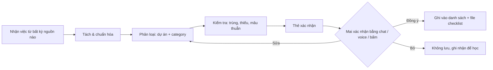
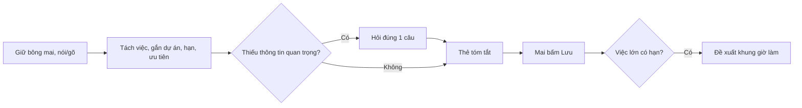
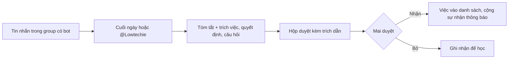
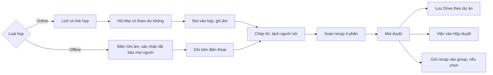
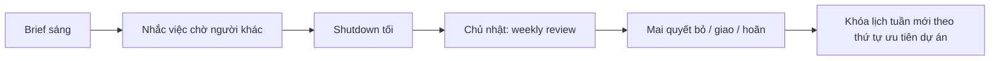

# PRD — Mai Lowtechie: Trợ lý AI Chief of Staff cá nhân & nhóm

*Phiên bản 2.8 — 23/09/2026. Bổ sung: UX/UI, user flow, ghi recap cuộc họp, điều phối thời gian chuẩn bị + di chuyển (mặc định BTS từ ga Bang Na), chuyến đi & checklist bay, nguyên tắc chat/voice cho mọi tính năng, nhập việc từ hình chụp, kiểm tra trước khi lưu và phân loại thông minh theo dự án + category; Học tập là dự án riêng; bỏ Favstay và Edge khỏi danh sách mặc định; Mai tự thêm/sửa dự án và sub category; trích xuất vé máy bay theo thời gian thực, kiểm tra chuyến bay, đính kèm vé; khách hàng/đối tác là trường riêng; sửa và tạo dự án, category, khách hàng ngay trong thẻ duyệt; deadline cho từng việc; Mai tự sắp xếp vị trí dự án, category, khách hàng; tạo lịch trong app → xem trước → book Google Calendar; kết nối Lark Mail, Lark Calendar và bot trong group chat Lark; chuỗi ngày bay đầy đủ hai đầu, chỉnh sửa được; sửa lỗi voice; xóa chuyến bay cũ; tự lưu vé PDF vào chuyến mới; sửa cảnh báo nửa đêm sai; cập nhật danh sách phương tiện; màn Lịch xem theo tháng, không giới hạn quá khứ/tương lai; lịch hẹn định kỳ dài hạn (gia hạn giấy tờ); tên khách hàng nhập một lần được lưu và gợi ý lại; mục ghi chú trong từng việc; nhắc đặt lịch trước với spa và các nơi cần booking; chạm để xem chi tiết việc, chỉ tick hoặc "Xong" mới đóng việc, mở lại việc cũ; màn chi tiết dự án (category, việc, khách hàng); danh bạ khách hàng liên kết với việc nhập bằng voice và ảnh; bỏ mục tiêu giờ/tuần; nhiều tài khoản email và lịch.*

Tài liệu đi kèm: **Mai Lowtechie — UI & user flow** (mockup màn hình) và **Checklist bay của Mai** (mẫu checklist tick được, dùng làm nguyên mẫu cho module 5.9).

---

## 1. Bối cảnh & vấn đề

Mai vận hành song song nhiều mảng: **Sorene AI** (sản phẩm + gọi vốn), **The Circle Technology** (tư vấn AI tại Bangkok, HCMC, Tokyo), cộng thêm **Học tập** (tiếng Thái và các khóa học) và việc cá nhân (spa, sức khỏe, giấy tờ).

Vấn đề cốt lõi không phải là thiếu công cụ to-do, mà là:

1. **Việc sinh ra ở khắp nơi** — Zalo, WhatsApp, email, cuộc họp, trong đầu — và không ai gom lại.
2. **Chi phí sắp xếp cao** — ghi task, gắn dự án, đặt deadline, xếp lịch đều là việc thủ công.
3. **Không nhìn thấy trade-off** — không biết tuần này thời gian thực sự đổ vào dự án nào, và dự án nào đang bị bỏ đói.
4. **Phối hợp với cộng sự rời rạc** — cam kết trong group chat ("mai em gửi nhé") bị trôi, không ai theo dõi.

## 2. Mục tiêu

| Mục tiêu | Đo bằng |
|---|---|
| Giao việc trong < 10 giây (chat hoặc voice) | Thời gian từ lúc nói đến lúc task được tạo |
| ≥ 80% đầu việc từ group chat được bắt tự động | So sánh với review thủ công hàng tuần |
| Tỷ lệ task trích xuất bị xóa vì sai/không cần < 20% | Precision của triage inbox |
| ≥ 90% việc được xếp đúng dự án + category mà Mai không phải sửa (sau 4 tuần dùng) | Log sửa phân loại |
| Mỗi sáng có brief, mỗi tuần có review | Tỷ lệ mở brief |
| Biết được % thời gian mỗi dự án/tuần | Báo cáo tuần |

**Không phải mục tiêu (v1):** thay thế Notion/Drive làm kho tài liệu; quản lý dự án kiểu Jira cho team lớn; tự động gửi tin nhắn thay Mai mà không duyệt.

## 3. Người dùng

- **Chính: Mai** — founder đa dự án, di chuyển giữa 3 múi giờ (ICT, ICT, JST), dùng tiếng Việt / Thái / Anh, thích nói hơn gõ khi di chuyển.
- **Phụ: cộng sự** — mỗi người có một assistant riêng, cùng chia sẻ không gian dự án chung.

## 4. Use case chính (user stories)

1. *"Nhắc chị gọi cho anh A bên OKR thứ Ba tuần sau, liên quan hợp đồng Circle"* → task gắn dự án Circle, deadline, reminder.
2. *(voice, đang đi taxi)* "Tuần này dời spa sang thứ Năm, và book 2 tiếng deep work cho Sorene pitch deck" → agent đề xuất slot, Mai bấm duyệt, lịch được tạo.
3. Group Zalo "Circle Core" bàn 40 tin nhắn → cuối ngày agent tóm tắt: 3 quyết định, 4 đầu việc (ai làm, hạn khi nào), 2 câu hỏi chưa có ai trả lời.
4. Sáng thứ Hai: "Hôm nay có gì?" → brief: lịch, 3 việc ưu tiên nhất, việc đang chờ người khác, deadline trong 7 ngày.
5. Cộng sự của Circle hỏi assistant của họ: "Mai đã duyệt proposal chưa?" → assistant trả lời từ không gian chung (không lộ việc riêng của Mai).
6. Chủ nhật: weekly review — thời gian đã dùng theo dự án, việc trễ hạn, đề xuất việc nên **bỏ hoặc hoãn**.
7. Họp với khách ở Bangkok (offline) → Mai bấm Ghi âm; 30 giây sau khi kết thúc có recap: quyết định, việc cần làm theo người, câu hỏi bỏ ngỏ.
8. Cuộc gọi Google Meet trong lịch → Lowtechie hỏi trước, vào họp ghi chú, gửi recap để Mai duyệt.

## 5. Yêu cầu chức năng

### 5.0 Nguyên tắc xuyên suốt: mọi thứ làm được bằng chat hoặc voice
Mai có thể ra **mọi** yêu cầu bằng chat (gõ) hoặc voice (nói), bằng tiếng Việt, tiếng Thái, tiếng Anh hoặc trộn lẫn. Không có tính năng nào bắt buộc phải bấm qua nhiều màn hình; giao diện chỉ để xem, duyệt nhanh và chỉnh sửa.

- **Kênh nhận lệnh:** ô chat và nút bông mai (giữ để nói) trong app; bot 1:1 trên Lark, Zalo, WhatsApp, Telegram (gõ hoặc gửi voice note); widget màn hình khóa / phím tắt điện thoại để nói ngay không cần mở app.
- **Lệnh nhiều ý trong một câu:** Lowtechie tách thành từng hành động và trình bày lại trong một thẻ tóm tắt.
- **Xác nhận bằng chính kênh đó:** trả lời "ok", "lưu đi", "đổi sang thứ Năm" bằng chat hoặc voice đều được; không bắt mở app để bấm.
- **Voice phải hoạt động ổn định trên điện thoại** (lỗi 22/9: voice trong prototype không hoạt động). Yêu cầu kỹ thuật:
  - Không dựa vào nhận dạng giọng nói có sẵn của trình duyệt (hỗ trợ không đều, đặc biệt trên iPhone và với tiếng Việt/Thái). Ghi âm trên máy rồi gửi lên dịch vụ speech-to-text có hỗ trợ tiếng Việt, tiếng Thái, tiếng Anh.
  - Xin quyền micro khi Mai bấm nút bông mai lần đầu, giải thích ngắn vì sao; nếu bị từ chối thì hiện hướng dẫn bật lại trong cài đặt.
  - Web app phải chạy trên HTTPS; nếu app chạy bên trong một khung nhúng (iframe) thì khung đó phải được cấp quyền micro.
  - Trạng thái rõ ràng: đang nghe / đang xử lý / lỗi (kèm lý do: không có quyền micro, mất mạng, không nghe rõ) và luôn có ô gõ chữ dự phòng.
  - Voice note gửi qua bot Lark/Zalo/WhatsApp là đường dự phòng khi voice trong app lỗi.
- **Phản hồi bằng giọng nói (tùy chọn):** khi Mai dùng voice lúc đang di chuyển, Lowtechie có thể đọc tóm tắt ngắn thay vì chỉ hiển thị chữ.
- **Hỏi lại tối đa một câu** khi thiếu thông tin quan trọng.

**Ví dụ lệnh theo module**
| Module | Chat / voice ví dụ |
|---|---|
| Giao việc | "Thứ Ba nhắc chị gửi báo giá cho OKR, dự án Circle, gấp" |
| Ảnh | *(gửi ảnh checklist)* + "việc của Circle, hạn thứ Sáu" |
| Lịch & di chuyển | "Tối nay 7 giờ hẹn ở Thonglor, đi tàu" / "Mai đi ô tô ra sân bay nhé" |
| Xem lịch | "Tháng 12 chị có gì?" / "Lần gia hạn trước là ngày nào?" |
| Tạo & book lịch | "Thứ Năm 2 giờ họp với Đô thị, tạo link Meet" → xem trước → "ok book đi" |
| Hồ sơ chuẩn bị | "Lần này chỉ cần 30 phút chuẩn bị thôi" |
| Chuyến đi | "Thứ Tư tuần sau chị bay Tokyo 4 ngày" / "Thêm máy uốn tóc vào checklist Tokyo" |
| Group chat | "Hôm nay group Circle Core có gì cần chị xử lý?" |
| Họp | "Ghi âm cuộc họp này" / "Gửi recap cho anh Tuấn" |
| Review | "Tuần này chị dồn thời gian vào đâu?" / "Bỏ việc viết lại trang About" |
| Học tập | "Hôm nay chị học tiếng Thái rồi" / "Tuần này học 4 buổi" |
| Dự án & category | "Tạo dự án Podcast" / "Thêm category Tuyển dụng vào Circle" |
| Ghi chú | "Ghi chú cho việc hợp đồng Đô Thị: khách muốn thêm điều khoản bảo trì" |
| Deadline | "Hạn thứ Sáu" / "Dời hợp đồng Đô thị sang thứ Hai" / "Việc này không có hạn" |
| Khách hàng / đối tác | "Việc này của khách Đô thị" / "Thêm đối tác OKR vào Circle" / "Cho chị xem hết việc của Đô thị" |
| Cá nhân | "Đặt lịch spa thứ Năm 4 giờ" / "Spa thứ Năm đặt rồi" / "Spa này cần đặt trước 3 ngày" |

### 5.1 Capture (thu thập)
- Nhập qua: chat trong app, voice note (VI/TH/EN, trộn ngôn ngữ), forward tin nhắn/email vào bot, chia sẻ ảnh chụp màn hình.
- Agent tự tách 1 câu nói thành nhiều task, gắn dự án, người, deadline, ưu tiên.
- Nếu độ tin cậy thấp → hỏi lại **một** câu, không hỏi dồn.

### 5.1.1 Nhập việc từ hình chụp
Mai gửi ảnh, Lowtechie tự trích danh sách việc.

- **Nguồn ảnh:** checklist viết tay trên giấy, bảng trắng sau buổi họp, sticky note, ảnh chụp màn hình (ghi chú điện thoại, tin nhắn, email, file Excel), tài liệu in.
- **Kênh gửi:** chụp trong app, chia sẻ từ thư viện ảnh (share sheet), gửi vào bot Lark/Zalo/WhatsApp/Telegram 1:1. Gửi nhiều ảnh một lần được.
- **Ảnh + lời nhắn đi kèm:** gửi ảnh kèm chat hoặc voice, ví dụ "đây là việc của Circle, hạn thứ Sáu", để gắn dự án và hạn cho cả danh sách.
- **Trích xuất:**
  - Từng dòng thành một việc; giữ cấu trúc nhóm/mục con nếu có.
  - Nhận biết ô đã tick / gạch ngang: mục đã xong được đánh dấu xong (hoặc bỏ qua), chỉ mục chưa xong thành việc mới.
  - Đọc ngày, tên người, dấu ưu tiên (*, !, gạch chân, khoanh tròn) nếu có.
  - Tiếng Việt, tiếng Thái, tiếng Anh, kể cả viết trộn.
- **Kết quả vào Hộp duyệt** dưới dạng một nhóm, ảnh gốc đính kèm làm nguồn; Mai nhận cả nhóm, hoặc sửa/bỏ từng dòng.
- **Dòng đọc không chắc** (chữ tay khó đọc, ảnh mờ, lóa) được đánh dấu riêng kèm vùng cắt từ ảnh để Mai xem và sửa nhanh.
- **Biến ảnh thành mẫu:** ảnh một danh sách dùng lặp lại (ví dụ đồ mang theo khi bay) có thể lưu thành mẫu checklist cho module 5.9 thay vì thành việc một lần.
- **Lưu ảnh:** ảnh gốc lưu theo thời hạn (ví dụ 90 ngày) rồi xóa, danh sách việc giữ lâu dài.

Độ khó kỹ thuật: thấp. Mô hình Claude đọc ảnh trực tiếp; phần việc chính là thiết kế bước duyệt và xử lý dòng đọc không chắc.

### 5.2 Task engine
- Trường dữ liệu: tiêu đề, dự án, người phụ trách, deadline (cứng/mềm), ưu tiên, trạng thái, ước lượng thời gian, nguồn (kênh + link/trích đoạn tin nhắn gốc), độ tin cậy.
- **Triage inbox**: mọi task trích xuất tự động vào hàng chờ duyệt trước, swipe để nhận/sửa/bỏ. Task do Mai tự giao đi thẳng vào danh sách.
- Ưu tiên tính theo: deadline, thứ tự ưu tiên dự án do Mai sắp xếp (5.3.1), phụ thuộc (đang chặn người khác?), năng lượng cần (deep/shallow).
- Loại đặc biệt: **Waiting-on** (việc đã giao/đang chờ người khác, tự nhắc follow-up), **Routine** (học tiếng Thái hằng ngày, spa định kỳ), **Hard deadline hành chính** (thuế, gia hạn giấy tờ, báo cáo pháp lý), **Hẹn định kỳ dài hạn** (mỗi 3 tháng, mỗi năm; xem 5.4.0).

### 5.2.1 Kiểm tra trước khi lưu & phân loại thông minh
**Nguyên tắc:** không việc nào được ghi vào danh sách hay file checklist (Google Sheets / Notion) khi chưa qua bước kiểm tra và Mai chưa xác nhận. Áp dụng cho mọi nguồn: chat, voice, ảnh, group chat, recap họp, email.

**Luồng**


**1. Tách & chuẩn hóa**
- Một câu nhiều ý thành nhiều việc; mỗi việc bắt đầu bằng động từ rõ ràng ("Gửi báo giá cho OKR", không phải "báo giá OKR").
- Việc quá to hoặc mơ hồ ("làm marketing Circle") → đề xuất tách thành 2–4 việc cụ thể hoặc hỏi lại.

**2. Phân loại vào đúng dự án và category**
- Hai tầng: **Dự án** → **Category**.

| Dự án | Category mặc định |
|---|---|
| Sorene | Sản phẩm · Gọi vốn · Tăng trưởng & cohort · Pháp lý & công ty |
| The Circle Technology | Khách hàng & bán hàng · Delivery dự án · Đào tạo · Marketing & nội dung · Hợp đồng |
| Học tập | Tiếng Thái · Khóa học & chứng chỉ · Đọc & nghiên cứu |
| Cá nhân | Sức khỏe & làm đẹp · Chuyến đi · Nhà cửa · Giấy tờ & tài chính cá nhân |
| Admin chung | Thuế & hạn pháp lý · Hóa đơn · Công cụ & tài khoản |

  Mai thêm, đổi tên, gộp category bằng chat/voice ("tạo category Tuyển dụng cho Circle").
- **Tín hiệu dùng để phân loại:** tên khách hàng/đối tác khớp với danh bạ khách hàng của dự án (kể cả tên gọi tắt, mục 5.3.2); từ khóa và tên riêng khác; nguồn (group chat, email, cuộc họp đã gắn dự án); người liên quan (cộng sự thuộc dự án nào); lịch sử (việc tương tự trước đây Mai xếp vào đâu); lời Mai nói kèm ("việc của Circle").
- **Mỗi việc có độ chắc chắn phân loại.** Dưới ngưỡng → hiện 2 lựa chọn dự án/category có khả năng nhất để Mai chọn một chạm, không đoán bừa.
- **Việc liên quan nhiều dự án:** một dự án chính + gắn tag dự án phụ.
- **Học từ sửa đổi:** mỗi lần Mai đổi dự án/category, hệ thống ghi lại và áp dụng cho lần sau (ví dụ: tên "OKR" luôn là Circle / Khách hàng & bán hàng).

**3. Kiểm tra trước khi lưu**
| Kiểm tra | Xử lý |
|---|---|
| Trùng với việc đã có | Đề xuất gộp, hoặc cập nhật việc cũ thay vì tạo mới |
| Thiếu hạn | Để trống và làm nổi ô Deadline trên thẻ duyệt để Mai tự điền khi nhận; **không tự đoán hạn** (xem 3c) |
| Thiếu người làm với việc cần có | Hỏi một câu |
| Hạn đã qua, rơi vào ngày Mai đang bay, hoặc trùng lịch dày | Cảnh báo và đề xuất ngày khác |
| Mâu thuẫn với việc/quyết định trước | Nêu rõ mâu thuẫn, để Mai chọn |
| Việc đã xong (ô đã tick trong ảnh, đã báo xong trong chat) | Đánh dấu xong, không tạo việc mới |
| Việc phụ thuộc việc khác | Gắn liên kết phụ thuộc |
| Ưu tiên | Gợi ý theo hạn + thứ tự dự án; Mai chỉnh được |

**3b. Sửa phân loại ngay trong thẻ duyệt** (lỗi phát hiện khi thử bản prototype 22/9: thẻ duyệt chỉ có một danh sách cố định "Dự án · Category", không sửa hay tạo mới được, và không có chỗ ghi khách hàng)
- Thẻ duyệt có **3 trường riêng**, sửa độc lập:
  1. **Dự án**
  2. **Category** (lọc theo dự án đã chọn)
  3. **Khách hàng / đối tác** (lọc theo dự án đã chọn, không bắt buộc)
  4. **Deadline** (xem 3c)
  5. **Ghi chú** (xem 3d)
- Mỗi trường là ô chọn **có tìm kiếm**: gõ vài chữ để lọc; nếu không có kết quả thì hiện dòng **"Tạo mới: …"** để tạo ngay tại chỗ, không phải rời thẻ duyệt. Mọi thứ tạo mới ở đây (category, khách hàng) được lưu vĩnh viễn và xuất hiện trong gợi ý các lần sau (xem 5.3.2).
- Không dùng một danh sách phẳng dài gộp tất cả "Dự án · Category": chọn dự án trước, category sau.
- Đổi tên hoặc xóa category / khách hàng làm ở màn Dự án (mục 5.3.1, 5.3.2); thẻ duyệt chỉ chọn và tạo mới để giữ thao tác nhanh.
- Sửa bằng chat/voice ngay trên thẻ: "việc này của khách Đô thị, category Hợp đồng".
- Mỗi lần Mai sửa, hệ thống ghi nhận để lần sau tự điền đúng (ví dụ: "hợp đồng website" + "Đô thị" → Circle · Hợp đồng · Đô thị).
- Nhóm việc từ ảnh: khi Mai bấm "Nhận cả nhóm", có thể đặt chung dự án / category / khách hàng / deadline cho cả nhóm trước khi nhận.

**3c. Deadline cho từng việc**
- **Mỗi việc có ô Deadline riêng** trên thẻ duyệt, cạnh Dự án / Category / Khách hàng.
- **Có hạn trong nguồn → tự điền.** Ngày tương đối ("thứ Sáu", "tuần sau", "cuối tháng", "trước khi bay") được quy đổi thành ngày cụ thể dựa trên **ngày giờ thực hôm nay và múi giờ của Mai**, và luôn hiện dạng đầy đủ để kiểm tra, ví dụ nguồn ghi "thứ Sáu" → hiện *Thứ Sáu 25/9/2026*. Kèm trích dẫn đoạn gốc chứa hạn.
- **Không có hạn trong nguồn → để trống**, ô Deadline được làm nổi. Lowtechie không tự đoán hạn; Mai tự điền khi nhận việc.
- **Điền nhanh:** nút chọn sẵn *Hôm nay · Ngày mai · Thứ Sáu này · Tuần sau · Cuối tháng*, lịch chọn ngày, hoặc gõ/nói tự do ("thứ Năm 3 giờ chiều", "25/10").
- **Tùy chọn giờ:** mặc định chỉ ngày; thêm giờ khi cần (ví dụ "trước 17:00").
- **Loại hạn:** hạn cứng (khách hàng, pháp lý, chuyến bay) hoặc hạn mềm (tự đặt); hạn cứng hiện nổi bật và được ưu tiên khi xếp lịch.
- **Không có hạn:** Mai có thể chọn rõ "Không có hạn". Nếu bấm "Lưu & nhận" mà ô Deadline vẫn trống, thẻ nhắc một lần "Chưa có deadline — thêm hay để không hạn?" rồi lưu theo lựa chọn.
- **Kiểm tra khi điền:** hạn đã qua, rơi vào ngày Mai đang bay, hoặc ngày đã kín lịch → cảnh báo nhẹ, Mai vẫn giữ được.
- **Sau khi lưu:** hạn đi vào cột Hạn của Google Sheets, xếp ưu tiên, brief sáng ("3 việc đến hạn hôm nay"), nhắc việc (mặc định 1 ngày trước và sáng ngày đến hạn, chỉnh được) và đề xuất khung giờ làm với việc lớn.
- **Đổi hạn sau:** bằng chat/voice ("dời hợp đồng Đô thị sang thứ Hai") hoặc sửa trong danh sách; lịch sử đổi hạn được lưu để weekly review chỉ ra việc bị dời nhiều lần.

**4. Thẻ xác nhận**
- Tóm tắt theo nhóm, ví dụ: *"5 việc mới: 3 Sorene / Gọi vốn, 2 Cá nhân / Chuyến đi. 1 việc trùng (đề xuất gộp), 1 việc thiếu hạn."*
- Mỗi dòng hiện: việc · dự án / category · hạn · người · ưu tiên · độ chắc chắn · nguồn.
- Xác nhận bằng bấm, chat hoặc voice: "ok lưu hết", "việc số 2 chuyển sang Circle", "bỏ việc cuối".
- Chỉ sau xác nhận mới ghi vào file; file ghi thêm cột **Nguồn** và **Ngày tạo** để truy vết.
- **Tự động dần:** khi độ chính xác phân loại của một loại việc đủ cao trong thời gian dài (ví dụ routine cá nhân), Mai có thể bật "lưu thẳng, báo sau" cho riêng loại đó. Mặc định luôn hỏi.

**3d. Ghi chú trong từng việc**
- **Mỗi việc có mục Ghi chú riêng**, có ngay trên thẻ duyệt (ô nhỏ, mở rộng khi chạm) và trong màn chi tiết việc.
- **Nội dung:** chữ nhiều dòng, gạch đầu dòng, link; đính kèm được ảnh, file (hợp đồng, báo giá) và ghi âm ngắn.
- **Nhập bằng chat/voice:** "ghi chú cho việc hợp đồng Đô Thị: khách muốn thêm điều khoản bảo trì 12 tháng". Voice được chuyển thành chữ và lưu vào ghi chú, giữ kèm file ghi âm gốc nếu Mai muốn.
- **Ghi chú của Mai tách riêng với trích dẫn nguồn:** đoạn tin nhắn / email / ảnh gốc mà Lowtechie trích ra vẫn nằm ở phần Nguồn; ô Ghi chú chỉ chứa những gì Mai viết hoặc đồng ý thêm vào. Lowtechie có thể **gợi ý** một ghi chú (ví dụ tóm tắt ngữ cảnh từ group chat), nhưng chỉ thêm khi Mai chấp nhận.
- **Nhật ký cập nhật:** mỗi lần thêm ghi chú mới được lưu thành một dòng có thời gian (ví dụ "22/9 19:10 — khách đã đồng ý giá"), để xem lại diễn biến của việc; sửa hoặc xóa từng dòng được.
- **Quyền xem:** ghi chú theo quyền của việc (Riêng tư / Dự án). Với việc chia sẻ cho cộng sự, Mai có thể đánh dấu một ghi chú là **chỉ mình xem**.
- **Tìm kiếm:** nội dung ghi chú được tìm cùng với tên việc ("việc nào có ghi chú về bảo trì?").
- **Đồng bộ:** ghi chú mới nhất hiện ở cột Ghi chú trong Google Sheets; toàn bộ nhật ký xem trong app.

### 5.2.2 Xem chi tiết việc, đánh dấu xong, mở lại việc cũ
**Chạm để xem, không phải để đóng**
- Chạm vào bất kỳ chỗ nào trên một việc (trừ ô tick) → mở **màn chi tiết việc**. Áp dụng ở mọi nơi có danh sách việc: Hôm nay, Dự án, Lịch, Khách hàng, kết quả tìm kiếm.
- Màn chi tiết gồm: tên việc (sửa được), Dự án · Category · Khách hàng, Deadline, ưu tiên, người làm, trạng thái, **Ghi chú** (nhật ký, 3d), **Nguồn** (trích dẫn tin nhắn / email / ảnh gốc, link mở lại nguồn), file đính kèm, sự kiện lịch liên quan, lịch sử thay đổi (ngày tạo, các lần đổi hạn).
- Nút trong màn chi tiết: **Xong** · Dời hạn · Sửa · Xóa.

**Chỉ hai cách để đóng việc**
1. Tick vào **ô tick ở đầu dòng**.
2. Bấm **Xong** trong màn chi tiết.
- Không có thao tác nào khác tự đóng việc: chạm vào dòng, vuốt, cuộn đều không đóng việc.
- Sau khi tick hoặc bấm Xong: việc mờ đi với hiệu ứng ngắn, hiện thông báo **"Đã xong · Hoàn tác"** trong vài giây để sửa khi tick nhầm.
- Đóng việc qua chat/voice ("xong việc chatbot rồi") vẫn được, nhưng luôn hiện thẻ xác nhận tên việc trước khi đóng, để không đóng nhầm việc có tên gần giống.

**Xem lại và mở lại việc đã xong**
- Việc đã xong **không bị xóa**; chuyển xuống mục **"Đã xong"** (thu gọn mặc định) ở cuối mỗi danh sách, và vẫn xem được trong màn Dự án, Khách hàng, tìm kiếm.
- Mở một việc đã xong → màn chi tiết đầy đủ như trên, hiện thêm ngày giờ hoàn thành.
- Nút **Mở lại** đưa việc về trạng thái trước khi đóng (giữ nguyên dự án, hạn, ghi chú); nếu hạn đã qua, hỏi có muốn đặt hạn mới không.
- Lọc "Đã xong" theo khoảng thời gian (tuần này, tháng trước…); weekly review dùng dữ liệu này.

**Hiển thị deadline trên danh sách** (lỗi thấy 22/9: "hạn Thứ Sáu 30/10 0:00")
- Việc chỉ có ngày, không có giờ → chỉ hiện ngày ("hạn Thứ Sáu 30/10"), không hiện "0:00".
- Chỉ hiện giờ khi Mai thực sự đặt giờ.

**Ưu tiên hôm nay** (ghi nhận từ cùng ảnh chụp)
- Việc có hạn còn xa (ví dụ Event 30/10, còn 5 tuần) chỉ lên mục Ưu tiên hôm nay khi Mai đánh dấu ưu tiên cao hoặc khi có việc chuẩn bị cần làm hôm nay; mặc định mục này ưu tiên việc đến hạn sớm và hạn cứng.

### 5.3 Dự án
- Mỗi dự án có: mục tiêu (dạng chữ, không bắt buộc), thành viên, kênh chat/email liên kết, khách hàng/đối tác, file liên kết, decision log.
- **Không có mục tiêu giờ/tuần.** Bỏ hoàn toàn trường "h/tuần" và vòng tiến độ theo giờ: Mai không bấm giờ làm việc nên con số đó luôn bằng 0 và gây nhiễu (thấy rõ 22–23/9: mọi dự án hiện "0h / mục tiêu 12h"). Thay bằng số việc đang mở, quá hạn và đến hạn 7 ngày tới.
- Dự án mặc định (khớp bảng category ở mục 5.2.1): Sorene, The Circle Technology, **Học tập**, Cá nhân, Admin chung. Đây chỉ là bộ khởi tạo; Mai toàn quyền thay đổi (mục 5.3.1).
- **Học tập** là dự án riêng với mục tiêu riêng (ví dụ số buổi tiếng Thái mỗi tuần, chuỗi ngày học), hiện riêng trong màn Dự án và Weekly review.

### 5.3.0 Màn chi tiết dự án
Chạm vào một dự án trên màn Dự án (ví dụ Circle) → mở **màn chi tiết dự án**.

**Phần đầu**
- Tên, màu, vòng thời gian tuần này so với mục tiêu, số việc đang mở / quá hạn / đến hạn 7 ngày tới.
- Nút nhanh: thêm việc vào dự án, book block làm việc cho dự án, mở Quản lý (sửa dự án).

**Ba cách xem (chuyển bằng tab)**
1. **Theo category** (mặc định): mỗi category là một nhóm thu gọn/mở rộng được, hiện số việc đang mở; bên trong là danh sách việc (tên, khách hàng, hạn, ưu tiên). Cuối mỗi nhóm có dòng "Đã xong (N)" thu gọn. Có ô "+ Thêm việc" ngay trong từng category (tự điền dự án và category).
2. **Theo khách hàng / đối tác**: mỗi khách là một nhóm với các việc của họ; chạm tên khách → màn chi tiết khách hàng (5.3.2).
3. **Theo hạn**: quá hạn → hôm nay → tuần này → sau đó → không hạn.

**Trong danh sách việc**
- Chạm vào việc → màn chi tiết việc (5.2.2); tick ở đầu dòng để đóng việc.
- Kéo một việc sang category khác để chuyển category.
- Lọc nhanh: của tôi / của cộng sự, có hạn / không hạn, ưu tiên cao.

**Các phần khác trong màn dự án**
- Lịch sắp tới của dự án (họp, block làm việc).
- Decision log và recap họp gần nhất.
- File liên quan (Drive, Lark).

**Màn Dự án (tổng quan) — chỉ là lưới thư mục**
- Màn này **chỉ gồm các ô dự án** (như thư mục) và nút Quản lý. **Bỏ danh sách "Việc đang mở (N)" ở phía dưới**, vì trùng với Hôm nay và Deadline 7 ngày tới (lỗi thấy 23/9).
- Mỗi dự án là **một ô riêng**, kể cả **Cá nhân**, **Học tập**, **Admin chung** — mỗi cái một ô, chạm vào là mở danh sách việc bên trong. Lỗi thấy 22–23/9: ba dự án này bị gộp thành một dòng chữ và không chạm vào được.
- Mỗi ô hiện: tên, màu, **số việc đang mở**, số việc quá hạn, số việc đến hạn trong 7 ngày. Không hiện giờ hay vòng tiến độ theo giờ.

### 5.3.1 Mai tự quản lý dự án & sub category
Danh sách dự án và category không cố định. Mai tự thêm, sửa, sắp xếp bằng **chat, voice** hoặc trong màn **Dự án**.

**Màn Quản lý dự án (sửa)**
- Mỗi dự án: tên, màu, mục tiêu (chữ), Tạm ngưng, Xóa, danh sách category, **danh sách khách hàng & đối tác**.
- **Bỏ ô "h/tuần"**.
- **Khách hàng & đối tác:** ô "+ khách hàng" mở ra cho Mai gõ tên, chọn loại (khách hàng / đối tác / nhà cung cấp), thêm tên gọi khác; tên đã thêm hiện thành thẻ có nút sửa và xóa, giống các thẻ category. Thêm nhiều tên liên tiếp không phải đóng mở lại.
- Chữ gợi ý trong ô không được cắt ngang ("+ khách hàng / đối t" → "+ khách hàng").

**Với dự án**
- Thêm mới: tên, màu, biểu tượng, mục tiêu (chữ), thành viên, kênh chat/email liên kết, từ khóa nhận diện.
- Sửa bất kỳ thuộc tính nào ở trên; đổi tên thì mọi việc, tab Google Sheets và bộ lọc tự cập nhật theo.
- **Lưu trữ** (tạm ngưng): ẩn khỏi Hôm nay và review, giữ nguyên dữ liệu, mở lại được bất cứ lúc nào.
- **Xóa:** bắt buộc chọn việc còn mở sẽ chuyển sang dự án nào hoặc lưu trữ cùng; không bao giờ xóa việc âm thầm.
- **Gộp hai dự án:** việc và category của dự án bị gộp chuyển sang dự án còn lại, category trùng tên được hợp nhất.
- Sắp xếp thứ tự hiển thị (kéo thả hoặc "đưa Học tập lên đầu").

**Với sub category**
- Thêm, đổi tên, xóa, gộp, di chuyển category sang dự án khác.
- Xóa hoặc gộp category → Lowtechie hỏi việc thuộc category đó chuyển về đâu trước khi thực hiện.
- Đặt mặc định cho từng dự án (việc chưa rõ category rơi vào đâu).

**Sắp xếp vị trí (dự án, category, khách hàng)**
- Mai tự quyết thứ tự ở **cả hai tầng**: thứ tự các dự án, và thứ tự category bên trong từng dự án. Danh bạ khách hàng của mỗi dự án cũng sắp xếp được.
- **Trong app:** màn Dự án có chế độ "Sắp xếp"; kéo thả bằng tay nắm ở đầu mỗi dòng. Có thêm nút Lên đầu / Xuống cuối cho thao tác một chạm.
- **Chuyển tầng / chuyển chỗ:** kéo một category sang dự án khác để chuyển nó (việc bên trong đi theo, Lowtechie xác nhận trước khi chuyển).
- **Bằng chat/voice:** "đưa Học tập lên đầu", "cho Hợp đồng lên trên Khách hàng & bán hàng trong Circle", "Đào tạo xuống cuối".
- **Thứ tự của Mai được dùng ở mọi nơi:** ô chọn trong thẻ duyệt, màn Hôm nay và Dự án, weekly review, thứ tự tab trong Google Sheets và thứ tự nhóm category trong mỗi tab.
- Ô chọn trong thẻ duyệt có thể thêm một mục nhỏ "Dùng gần đây" ở trên cùng, nhưng phần danh sách chính luôn giữ đúng thứ tự Mai đặt; Lowtechie không tự đảo thứ tự.
- Việc mới tạo (dự án, category, khách hàng) được thêm vào cuối danh sách; Mai kéo lên nếu muốn.
- Thay đổi thứ tự hoàn tác được.

**Lowtechie gợi ý nhưng không tự đổi cấu trúc**
- Khi có nhiều việc không khớp category nào, hoặc Mai hay sửa một kiểu → đề xuất tạo category mới ("Có 6 việc về tuyển dụng ở Circle, tạo category Tuyển dụng không?").
- Dự án không có hoạt động 30 ngày → hỏi có muốn lưu trữ không.
- Mọi thay đổi cấu trúc đều cần Mai xác nhận, và có thể hoàn tác.

**Ví dụ lệnh**
| Mai nói / gõ | Lowtechie làm |
|---|---|
| "Tạo dự án mới tên Podcast, màu cam, 3 tiếng mỗi tuần" | Tạo dự án, hỏi có muốn thêm category không |
| "Thêm category Tuyển dụng vào Circle" | Thêm category |
| "Đổi tên Admin chung thành Hành chính" | Đổi tên dự án, cập nhật file |
| "Gộp Khóa học với Đọc & nghiên cứu" | Hỏi tên category sau khi gộp, chuyển việc |
| "Tạm ngưng dự án Podcast" | Lưu trữ dự án |
| "Đưa Hợp đồng lên đầu trong Circle" | Đổi vị trí category, cập nhật thứ tự ở mọi màn và trong file |

### 5.3.2 Khách hàng & đối tác
Circle (và các dự án khác) có nhiều khách hàng và đối tác. **Khách hàng/đối tác là một trường riêng, không phải category.** Category trả lời "đây là loại việc gì" (Hợp đồng, Delivery, Đào tạo…); khách hàng trả lời "việc này cho ai". Nếu biến mỗi khách hàng thành một category, số category sẽ nhân lên theo số khách hàng và không còn lọc được theo loại việc.

Ví dụ: *"Ký lại hợp đồng website"* → **Circle · Hợp đồng · Khách hàng: Đô thị**.

**Danh bạ khách hàng/đối tác theo dự án**
- Mỗi mục gồm: tên, loại (khách hàng / đối tác / nhà cung cấp), tên gọi tắt và cách gọi khác (ví dụ "Đô thị", tên công ty đầy đủ, tên người liên hệ), người liên hệ, trạng thái (đang làm / tiềm năng / đã kết thúc), group chat và email liên kết, ghi chú.
- Một khách hàng có thể thuộc nhiều dự án (ví dụ vừa là khách của Circle vừa là đối tác của Sorene).
- Mai thêm, sửa, gộp (khi trùng tên), lưu trữ bằng chat, voice, màn Dự án, hoặc tạo nhanh ngay trong thẻ duyệt.

**Nhập một lần, lần sau chỉ cần chọn** (lỗi thấy 22/9: nhập "Đô Thị" trong thẻ duyệt nhưng lần sau vẫn phải nhập lại)
- Khi Mai gõ một tên khách hàng/đối tác mới trong thẻ duyệt và lưu việc, tên đó **tự động được thêm vào danh bạ** của dự án đang chọn, kể cả khi Mai không bấm dòng "Tạo mới". Không có tên nào chỉ nằm trên một việc rồi mất.
- Danh bạ lưu trên máy chủ, đồng bộ mọi thiết bị; không chỉ lưu tạm trên màn hình.
- **Lần sau:** ô Khách hàng / đối tác hiện danh sách gợi ý ngay khi mở, sắp theo: khách vừa dùng gần đây → khách hay dùng nhất trong dự án → còn lại theo thứ tự Mai đặt.
- **Gõ vài chữ là ra:** tìm không phân biệt hoa/thường và dấu, ví dụ "do thi", "đô thị", "Đô Thị" đều ra cùng một khách "Đô Thị".
- **Không tạo trùng:** tên mới gần giống tên đã có (khác hoa/thường, khác dấu, thừa khoảng trắng) → hỏi "Có phải Đô Thị?" thay vì tạo thêm một mục.
- **Tự điền:** nội dung việc có nhắc tên khách đã có trong danh bạ → ô khách hàng tự điền sẵn; Mai chỉ cần kiểm tra.
- Tên đã lưu sửa hoặc gộp được ở màn Dự án (đổi tên thì mọi việc cũ cập nhật theo).

**Liên kết danh bạ với việc nhập bằng voice và ảnh**
- Mai thêm khách hàng / đối tác ở màn Quản lý dự án (ô "+ khách hàng / đối tác"), trong thẻ duyệt, hoặc bằng chat/voice ("thêm khách Đô Thị vào Circle").
- Mỗi khách có thêm **tên gọi khác**: viết tắt, không dấu, tên tiếng Anh/Thái, tên người liên hệ (ví dụ "Đô Thị", "do thi", "ĐT", tên anh/chị phụ trách). Mai thêm được bất cứ lúc nào.
- **Voice:** danh sách tên khách và tên gọi khác được đưa vào bước chuyển giọng nói thành chữ như từ vựng ưu tiên, để tên riêng được nghe đúng; sau đó so khớp gần đúng (không phân biệt hoa/thường, dấu, lỗi chính tả nhỏ) với danh bạ.
- **Ảnh (chữ tay, bảng trắng, chụp màn hình):** chữ đọc được từ ảnh cũng so khớp gần đúng với danh bạ, kể cả viết tắt Mai đã khai báo.
- **Kết quả trên thẻ duyệt:** ô Khách hàng tự điền, kèm dòng nhỏ cho biết nhận ra từ đâu (ví dụ *nhận từ "đô thị" trong câu nói*), để Mai kiểm tra nhanh.
- **Không chắc** (khớp nhiều khách hoặc độ khớp thấp) → hiện 2 lựa chọn gần nhất để Mai chọn một chạm; **tên lạ trông giống khách hàng** → gợi ý "Tạo khách hàng mới?".
- Mỗi lần Mai sửa ô khách hàng trên thẻ duyệt, cách viết/cách nói đó được thêm vào tên gọi khác của khách, để lần sau nhận đúng.
- Lỗi hiển thị thấy 22/9: chữ gợi ý trong ô "+ khách hàng / đối tác" bị cắt thành "+ khách hàng / đối t"; ô phải đủ rộng hoặc dùng chữ ngắn hơn ("+ khách hàng").

**Nhận diện tự động**
- Khi trích việc, Lowtechie so tên trong nội dung với danh bạ (kể cả tên gọi tắt) để điền khách hàng.
- Gặp tên chưa có trong danh bạ → đề xuất "Tạo khách hàng mới 'Đô thị' cho Circle?" thay vì bỏ trống hoặc đoán.
- Việc đến từ group chat/email đã gắn với một khách hàng → tự điền khách hàng đó.

**Xem theo khách hàng**
- Màn chi tiết khách hàng: tất cả việc (mở và đã xong) theo category, việc đang chờ phía khách, lần liên hệ gần nhất, recap các cuộc họp với khách, hợp đồng và file liên quan.
- Hỏi bằng chat/voice: "Đô thị đang còn việc gì?", "Tuần này có khách nào chưa được follow-up?".
- Weekly review có thể xem thời gian theo khách hàng của Circle, không chỉ theo dự án.

### 5.4 Calendar agent
- Đọc/ghi **Google Calendar và Lark Calendar**.
- **Hai hệ lịch, một góc nhìn:** app gộp lịch từ cả Google và Lark để hiển thị và để kiểm tra trùng giờ; khi tìm giờ trống, bận ở bất kỳ lịch nào cũng tính là bận.
- **Lịch đích theo quy tắc:** Mai đặt mặc định theo dự án (ví dụ Circle → Lark Calendar, Cá nhân / Học tập → Google Calendar); thẻ xem trước luôn hiện lịch đích và cho đổi một chạm.
- **Không tạo trùng:** một sự kiện chỉ được book vào một lịch đích. Nếu Mai đã tự đồng bộ hai lịch với nhau (đăng ký lịch chéo), app nhận ra bản sao và không tính trùng hai lần.
- Link họp online: Google Meet khi book vào Google Calendar, Lark Meeting (Lark VC) khi book vào Lark Calendar.
- Tìm slot trống có tính múi giờ, thời gian di chuyển, và "vùng bảo vệ" (deep work, nghỉ).
- **Time-blocking**: tự đặt block cho task lớn trước deadline.
- **Mọi hành động ghi lịch đều cần Mai bấm duyệt** ở v1; cho phép tự động hóa dần theo từng loại (ví dụ: routine cá nhân được tự đặt).
- Đặt lịch với người khác: soạn tin đề xuất giờ, Mai duyệt trước khi gửi.

**Tạo lịch trong app → xem trước → book lên Google Calendar**
Mai tạo lịch bằng chat, voice hoặc form trong app (ví dụ *"Thứ Năm 2 giờ chiều họp với Đô thị ở Thonglor, mời anh Tuấn"*). Lowtechie **không ghi gì lên Google Calendar** cho đến khi Mai xem **thẻ xem trước** và bấm Book.

*Thẻ xem trước gồm:*
- Tiêu đề sự kiện
- Ngày, giờ bắt đầu – kết thúc, thời lượng, múi giờ (nếu khác thành phố Mai đang ở thì hiện cả hai giờ)
- Lặp lại (nếu có): hằng tuần, hằng tháng…
- Địa điểm (khớp Google Maps) hoặc **link họp online** (tự tạo Google Meet nếu Mai chọn)
- Người được mời, và ghi rõ **"Sẽ gửi email mời cho N người"**
- Nhắc nhở (mặc định theo loại sự kiện, chỉnh được)
- Dự án · category · khách hàng, màu lịch theo dự án
- Lịch đích: Google Calendar hoặc Lark Calendar (và lịch con cụ thể), theo quy tắc mặc định của dự án
- Ghi chú mô tả và file đính kèm (nếu có)
- **Chuỗi block đi kèm** (5.4.1): Chuẩn bị → Di chuyển → sự kiện, hiện riêng từng block, mỗi block bật/tắt được
- **Cảnh báo:** trùng lịch, nằm trong vùng bảo vệ (deep work), rơi vào ngày bay, hoặc không kịp di chuyển từ cuộc hẹn trước

*Nút:* **Book** · **Sửa** · **Hủy**. Xác nhận hoặc sửa bằng chat/voice cũng được ("ok book đi", "đổi sang 3 giờ", "bỏ block di chuyển", "đừng mời anh Tuấn").

*Quy tắc:*
- **Gửi lời mời cho người khác luôn cần xác nhận riêng**, kể cả sau này khi Mai bật chế độ tự động cho các loại lịch khác, vì hành động này gửi email ra ngoài.
- Sau khi book: hiện "Đã book" kèm link mở trong Google Calendar, và nút **Hoàn tác** trong vài phút (xóa sự kiện và các block đi kèm; nếu đã gửi lời mời thì hủy kèm thông báo).
- **Đồng bộ hai chiều:** Mai sửa hay xóa sự kiện trực tiếp trên Google Calendar → app cập nhật theo, và chuỗi block chuẩn bị/di chuyển tự dời hoặc hỏi lại.
- Sửa sự kiện đã book cũng đi qua thẻ xem trước, chỉ hiện phần thay đổi (trước → sau).
- **Tự động dần:** Mai có thể bật "book thẳng, báo sau" cho từng loại lịch không mời ai (ví dụ block học tiếng Thái, spa định kỳ). Mặc định luôn hỏi.

### 5.3.3 Danh sách "Deadline 7 ngày tới" và "Ưu tiên hôm nay" phải đầy đủ
Lỗi thấy 23/9: màn Hôm nay hiện thiếu việc so với danh sách việc trong màn Dự án.
- **Một nguồn dữ liệu duy nhất:** mọi danh sách (Hôm nay, Deadline 7 ngày tới, Dự án, chi tiết dự án) đọc từ cùng một truy vấn việc đang mở; không màn nào giữ bản sao riêng.
- **Không giới hạn cứng số dòng.** Nếu danh sách dài, nhóm theo ngày (Hôm nay · Ngày mai · Thứ Năm…) và thu gọn phần sau với dòng "Xem tất cả (N)", chứ không âm thầm cắt bớt.
- **Tiêu đề có số đếm:** "Deadline 7 ngày tới (N)" để Mai biết ngay khi thiếu.
- Khoảng thời gian tính theo **ngày địa phương**: từ hôm nay đến hết ngày thứ 7 tính từ hôm nay.
- Việc không có hạn không lên danh sách này; chúng nằm trong màn Dự án và mục "Không hạn".
- **Test:** số việc trong "Deadline 7 ngày tới" phải đúng bằng số việc đang mở có hạn trong khoảng đó khi lọc ở màn Dự án; thử với 20+ việc cùng hạn "ngày mai".

### 5.3.4 Kết nối nhiều tài khoản (Google và Lark)
Mai dùng song song nhiều hộp thư và lịch: Gmail công việc (mai@sorene.ai), Gmail cá nhân, và email The Circle trên Lark. App phải kết nối **nhiều tài khoản cùng lúc**, không phải chọn một.

**Màn Kết nối**
- Danh sách tài khoản đã kết nối, mỗi dòng: biểu tượng nhà cung cấp (Google / Lark), địa chỉ email, và những gì đang bật: **Lịch · Mail · Drive**.
- Nút **Thêm tài khoản** → chọn Google hoặc Lark → đăng nhập. Thêm được không giới hạn số tài khoản Google.
- Mỗi tài khoản: bật/tắt từng phần, **Kết nối lại** khi phiên đăng nhập hết hạn, **Ngắt kết nối** (hỏi rõ dữ liệu đã lưu sẽ giữ hay xóa).
- Trạng thái đồng bộ: lần đồng bộ gần nhất, lỗi nếu có.

**Lịch**
- Dưới mỗi tài khoản là danh sách lịch con (lịch chính, lịch nhóm, lịch đã đăng ký) với ô bật/tắt hiển thị.
- **Tất cả lịch đang bật đều được tính khi kiểm tra bận/rảnh**, kể cả lịch chỉ xem.
- **Lịch đích mặc định theo dự án:** ví dụ Circle → lịch Lark của The Circle, Sorene → mai@sorene.ai, Cá nhân → Gmail cá nhân. Thẻ xem trước (5.4) luôn hiện lịch đích và cho đổi.
- Màu sự kiện theo dự án; có thể bật thêm dấu nhỏ cho biết sự kiện thuộc tài khoản nào.
- Cùng một sự kiện xuất hiện ở hai tài khoản (do được mời chéo) → nhận ra là một, không đếm trùng.

**Mail**
- Quét vé máy bay, xác nhận đặt chỗ, email khách hàng **trên tất cả hộp thư đã kết nối**; kết quả ghi rõ đến từ hộp thư nào.
- Soạn thư trả lời: mặc định gửi từ hộp thư đã nhận thư đó; Mai đổi được trước khi gửi.
- Lọc theo tài khoản ở mọi nơi có kết quả từ email.

### 5.4.0 Màn Lịch: xem theo ngày, tuần, tháng — không giới hạn thời gian
- **Chế độ xem:** Ngày · Tuần · **Tháng** · Danh sách (các sự kiện sắp tới, cuộn liên tục). Mai chọn chế độ mặc định; app nhớ chế độ lần trước.
- **Xem theo tháng:**
  - Mỗi ngày hiện chấm màu theo dự án (tối đa vài chấm, thêm "+N" nếu nhiều); ngày có hạn cứng, chuyến bay hoặc hẹn gia hạn giấy tờ có biểu tượng riêng dễ nhận ra.
  - Chạm vào một ngày → danh sách sự kiện và việc đến hạn của ngày đó ngay bên dưới.
  - Vuốt trái/phải để chuyển tháng; nút **Hôm nay** để quay về; chọn nhanh tháng/năm bất kỳ.
- **Không giới hạn thời gian:** cuộn tới tương lai hay lùi về quá khứ bao xa cũng được (ví dụ xem lại lịch năm ngoái, hoặc xem hẹn gia hạn sau 1 năm). Dữ liệu được tải dần theo tháng đang xem từ Google Calendar và Lark Calendar, không tải trước toàn bộ.
- **Lịch cũ:** sự kiện đã qua vẫn xem được đầy đủ (giờ, địa điểm, ghi chú, file đính kèm, recap họp nếu có).
- **Tìm kiếm trên toàn bộ lịch:** gõ hoặc nói "visa", "Đô thị", "spa" → mọi sự kiện khớp, cả quá khứ và tương lai, sắp theo thời gian.
- **Lọc** theo dự án, khách hàng, lịch nguồn (Google / Lark), loại (sự kiện / hạn việc / chuyến bay).
- Hỏi bằng chat/voice: "tháng 12 chị có gì?", "lần gia hạn trước là ngày nào?", "năm sau có hẹn gì cố định?".

**Lịch hẹn định kỳ dài hạn (ví dụ gia hạn visa mỗi 3 tháng, mỗi năm)**
- Tạo lịch lặp theo chu kỳ bất kỳ: mỗi tuần, mỗi tháng, **mỗi 3 tháng**, mỗi 6 tháng, **mỗi năm**, hoặc tùy chỉnh ("mỗi 90 ngày").
- **Tính theo ngày thực tế:** nếu lần gia hạn thực tế sớm hay muộn hơn lịch, Mai cập nhật ngày thực tế và các lần sau tự tính lại từ ngày đó ("gia hạn xong hôm nay, lần sau sau 3 tháng").
- **Nhắc trước nhiều mốc:** mặc định 30 ngày, 14 ngày, 7 ngày và 1 ngày trước; chỉnh được cho từng loại hẹn.
- **Việc chuẩn bị tự tạo trước mỗi lần hẹn:** ví dụ "chuẩn bị giấy tờ", "đặt lịch hẹn", "chụp ảnh", theo một mẫu checklist Mai tự sửa (giống checklist bay).
- **Lịch sử từng lần:** mỗi lần hẹn lưu ngày thực hiện, ghi chú, file đính kèm (biên nhận, bản chụp giấy tờ); xem lại được bất cứ lúc nào.
- Thuộc dự án mặc định Cá nhân · Giấy tờ & tài chính cá nhân (hoặc Admin chung); được đánh dấu **hạn cứng** và luôn hiện nổi bật trên màn Tháng.
- Kiểm tra xung đột: hẹn gia hạn trùng ngày bay hoặc Mai đang ở thành phố khác → cảnh báo sớm (từ mốc nhắc 30 ngày).

### 5.4.1 Điều phối thời gian: chuẩn bị + di chuyển
Mục tiêu: Mai chỉ cần nói "hẹn 19:00 ở Thonglor" hoặc "bay 10:30 từ Suvarnabhumi", Lowtechie tự tính ngược và khóa lịch để biết **khi nào bắt đầu chuẩn bị** và **khi nào phải đi**.

**Tính ngược từ giờ hẹn**
```
Giờ hẹn 19:00 (Thonglor)
  − đệm đến sớm (10 phút)
  − di chuyển (Google Maps, giao thông dự báo lúc 18:xx, mô hình "ngày xấu")
  − đệm rời nhà (10 phút: thang máy, gọi xe)
  − chuẩn bị (1 tiếng 30: tắm + make up)
  = giờ bắt đầu chuẩn bị
```
Kết quả trên lịch: 3 block liên tiếp, **Chuẩn bị** → **Di chuyển** → **Cuộc hẹn**, màu nhạt hơn cuộc hẹn chính, đánh dấu "bận".

**Hồ sơ chuẩn bị (Mai tự đặt, dùng lại)**
| Loại | Thời gian | Khi nào áp dụng |
|---|---|---|
| Ra ngoài đầy đủ (tắm + make up) | 1 tiếng 30 | Hẹn gặp trực tiếp, sự kiện |
| Ra ngoài nhanh | 30 phút | Cà phê gần nhà, spa |
| Họp online có quay mặt | 20 phút | Họp video với khách |
| Không cần chuẩn bị | 0 | Việc cá nhân, họp chỉ audio |
Lowtechie gợi ý hồ sơ theo loại sự kiện; Mai đổi bằng một chạm.

**Sân bay**
- Chuyến bay dùng **chuỗi ngày bay đầy đủ hai đầu** (xem mục 5.9, "Chuỗi ngày bay").
- Đọc email xác nhận vé (Gmail) để lấy giờ bay, sân bay, nhà ga; giờ bay luôn lưu theo múi giờ địa phương của sân bay đi/đến.
- Đổi giờ bay → cả chuỗi block tự dời theo.

**Địa điểm & điểm xuất phát**
- Lưu các địa điểm quen: Nhà (Bangkok), Nhà (HCMC), khách sạn khi ở Tokyo, văn phòng.
- Điểm xuất phát = nơi Mai ở ngay trước đó trên lịch (nếu có cuộc hẹn trước), không mặc định là nhà. Hai cuộc hẹn liền nhau thì tính đường giữa hai nơi.
- Hỏi lại khi địa điểm mơ hồ ("Thonglor" là cả một khu → xin tên quán hoặc dùng điểm giữa khu, ghi chú rõ).

**Phương tiện: mặc định tàu điện**
- Ở Bangkok, Lowtechie **mặc định tính theo tàu điện (BTS)**. Chỉ tính theo ô tô khi Mai nói rõ ("tối nay đi ô tô", "book Grab").
- **Tuyến quen từ nhà:** Nhà (Bangkok) → đi bộ → **BTS Bang Na** → tàu → ga gần điểm hẹn → đi bộ đến nơi.
- **Thời gian đi bộ nhà → BTS Bang Na:** Google Maps tính một lần từ địa chỉ nhà đã lưu (chế độ đi bộ), Mai xem và chỉnh nếu thực tế khác (ví dụ tính cả thang máy, lên ga). Lưu lại, không gọi API mỗi lần.
- **Chuỗi tính ngược khi đi tàu:**
```
Giờ hẹn
  − đệm đến sớm (10 phút)
  − đi bộ từ ga xuống đến nơi hẹn (Google Maps)
  − thời gian tàu + đổi tuyến nếu có (Google Maps, chế độ phương tiện công cộng)
  − đệm chờ tàu / qua cổng (5 phút)
  − đi bộ nhà → BTS Bang Na (giá trị đã lưu)
  − đệm rời nhà (10 phút)
  − chuẩn bị (theo hồ sơ)
  = giờ bắt đầu chuẩn bị
```
- Với phương tiện công cộng, Google Maps cho phép nhập thẳng **giờ muốn đến**, nên phép tính gọn và chính xác hơn so với ô tô.
- **Trời mưa:** nếu dự báo mưa vào giờ đi, cộng thêm đệm cho đoạn đi bộ (mặc định +10 phút) và nhắc mang ô.
- **Khi tàu điện không hợp lý** (ví dụ sân bay Suvarnabhumi phải đổi nhiều tuyến, hoặc điểm hẹn cách ga quá xa để đi bộ): Lowtechie vẫn tính theo tàu, nhưng hiện thêm phương án ô tô bên cạnh để Mai chọn; không tự đổi.
- Ở HCMC và Tokyo: phương tiện mặc định đặt riêng cho từng thành phố.

**Cảnh báo "đến giờ"**
- Thông báo lúc bắt đầu chuẩn bị, và lúc phải đi (kèm link mở Google Maps chỉ đường).
- 45–60 phút trước giờ đi, kiểm tra lại giao thông thực tế; nếu chậm hơn dự kiến > 10 phút → báo "đi sớm hơn 15 phút" và dời block.
- Xung đột (chuẩn bị chồng lên cuộc họp trước) → cảnh báo ngay lúc đặt lịch, đề xuất dời hoặc chuẩn bị rút gọn.

**Giới hạn cần biết**
- Google Maps Routes API cho phép chọn giờ **đến** chỉ với phương tiện công cộng (đúng với lựa chọn mặc định BTS của Mai); với ô tô chỉ nhập được giờ **đi**, nên khi Mai đi ô tô hệ thống phải thử vài giờ đi và chọn giờ muộn nhất vẫn đến kịp.
- Cần kiểm tra chất lượng dữ liệu lịch tàu BTS/MRT trên Google Maps bằng vài chuyến thật trước khi tin hoàn toàn.
- Dự báo giao thông nhiều ngày trước chỉ là ước lượng lịch sử; con số chính xác nhất là lần kiểm tra lại trước giờ đi.
- Không lấy được thời gian chờ Grab thực tế qua API; dùng đệm cố định.

### 5.4.2 Nhắc đặt lịch trước (spa và các nơi cần booking)
Một số lịch chỉ thành khi Mai **đã đặt chỗ với nơi đó**: spa, làm tóc/nail, nhà hàng, phòng khám, lịch hẹn giấy tờ. Lowtechie nhắc đặt chỗ đủ sớm và theo dõi đến khi đặt xong.

**Nơi cần đặt chỗ**
- Địa điểm đã lưu có thêm thông tin đặt chỗ: **cần đặt trước** (có/không), **đặt trước bao lâu** (ví dụ spa 3 ngày, nhà hàng cuối tuần 7 ngày), **cách đặt** (gọi điện, LINE, Zalo, WhatsApp, website, app đặt chỗ) kèm số điện thoại / link.
- Lowtechie gợi ý bật "cần đặt trước" theo loại nơi (spa, salon, nhà hàng, phòng khám); Mai xác nhận một lần cho mỗi nơi, lần sau tự áp dụng.

**Khi tạo lịch ở nơi cần đặt chỗ**
- Sự kiện trên lịch hiện trạng thái **"Chưa đặt chỗ"** (biểu tượng riêng trên màn Ngày/Tuần/Tháng) cho đến khi Mai xác nhận đã đặt.
- Tự tạo việc **"Đặt lịch [nơi] cho [ngày giờ]"** với deadline = ngày hẹn trừ thời gian đặt trước, vào dự án Cá nhân · Sức khỏe & làm đẹp (hoặc dự án của sự kiện).
- **Nhắc theo mốc:** vào ngày cần đặt; nếu chưa đặt, nhắc lại hôm sau; 24 giờ trước giờ hẹn mà vẫn chưa đặt → cảnh báo "lịch này có thể không thành, đặt ngay hoặc dời?".
- **Đặt chỗ một chạm:** nhắc việc có nút gọi điện, mở LINE/Zalo/WhatsApp với **tin nhắn soạn sẵn** (ngôn ngữ theo nơi đó: tiếng Thái, Việt, Anh), hoặc mở link đặt chỗ. Ví dụ tin soạn sẵn cho spa ở Bangkok bằng tiếng Thái, ghi ngày giờ và dịch vụ.
- Lowtechie **không tự gửi tin đặt chỗ**; Mai xem tin soạn sẵn và tự gửi (hoặc xác nhận để bot gửi, nếu kênh đó đã kết nối).

**Sau khi đặt**
- Mai bấm "Đã đặt" hoặc nói "spa thứ Năm đặt rồi"; có thể thêm mã xác nhận, tên nhân viên, ghi chú.
- Email / tin nhắn xác nhận đặt chỗ đến Gmail hoặc Lark Mail → tự nhận ra, đánh dấu đã đặt, lưu vào ghi chú của sự kiện.
- Nơi đặt đổi giờ → cập nhật sự kiện qua thẻ xem trước (5.4) và dời chuỗi chuẩn bị + di chuyển.

**Lịch định kỳ cần đặt chỗ** (ví dụ spa mỗi 2 tuần)
- Mỗi lần lặp tự sinh một nhắc đặt chỗ riêng theo đúng thời gian đặt trước của nơi đó.
- Tùy chọn: nhắc đặt luôn lần kế tiếp ngay sau buổi hiện tại ("đặt luôn buổi sau khi đang ở spa").

### 5.5 Ingest group chat (Zalo / WhatsApp)
- Đọc tin nhắn các group được cho phép (allowlist), tóm tắt theo lịch (cuối ngày hoặc khi có `@bot`).
- Trích xuất: đầu việc, người nhận, hạn, quyết định, câu hỏi bỏ ngỏ, cam kết ngầm ("để em lo").
- Lưu kèm trích dẫn gốc để kiểm chứng.
- Xem mục 8 về giới hạn kỹ thuật — **đây là phần rủi ro nhất của sản phẩm.**

### 5.5.1 Lark: group chat, email và lịch
Lark là kênh **chính thức và dễ tích hợp nhất** trong các kênh chat của Mai: bot được thêm vào group công khai, có API đọc tin nhắn, gửi tin, đọc/ghi lịch. Nên ưu tiên đưa các group làm việc cốt lõi (Circle, Sorene, cộng sự) lên Lark.

**Bot Lowtechie trong group chat Lark**
- Mai (hoặc admin group) thêm bot "Mai Lowtechie" vào group; bot hiện diện công khai, thông báo một lần khi vào group rằng nó ghi nhận việc và quyết định.
- **Hai chế độ theo từng group** (Mai chọn):
  - **Chỉ khi được gọi:** bot chỉ đọc tin nhắn có @Lowtechie ("@Lowtechie ghi việc này: Linh gửi proposal cho Đô thị thứ Sáu"). Quyền tối thiểu, phù hợp group có khách hàng.
  - **Đọc toàn bộ group:** bot đọc mọi tin nhắn để tự trích việc, quyết định, câu hỏi bỏ ngỏ. Cần quyền đọc toàn bộ tin nhắn group của Lark và admin tổ chức duyệt; chỉ bật cho group nội bộ đã được mọi người đồng ý.
- **Gắn group với dự án và khách hàng** (ví dụ group "Circle × Đô thị" → Circle · khách hàng Đô thị) để việc trích ra được tự điền đúng.
- Việc trích ra đi qua **Hộp duyệt** như mọi nguồn khác (5.2.1): kèm link về tin nhắn gốc trong Lark, deadline, dự án / category / khách hàng.
- Đọc cả file và ảnh gửi trong group (hợp đồng, ảnh bảng trắng) để trích việc (5.1.1).
- **Lưu lại:** tóm tắt cuối ngày của mỗi group, danh sách việc và decision log lưu vào app theo dự án, đồng bộ sang Google Sheets; tùy chọn lưu recap vào Lark Docs của group.
- **Bot có thể trả lời trong group** khi được gọi: "@Lowtechie việc của Linh tuần này là gì?". Chỉ trả lời bằng dữ liệu cấp Dự án, không bao giờ lộ việc Riêng tư của Mai.
- Gửi tin vào group (nhắc hạn, gửi recap) luôn cần Mai xác nhận trước.

**Lark Mail**
- Đọc email trong hộp thư Lark giống Gmail: trích việc từ email, quét vé máy bay và xác nhận đặt chỗ (5.9), nhận lời mời họp.
- Email gắn với khách hàng (theo tên miền hoặc người gửi trong danh bạ, 5.3.2) được tự điền khách hàng.
- Soạn email trả lời hoặc follow-up: Lowtechie soạn nháp, Mai duyệt trước khi gửi.

**Lark Calendar**
- Đọc/ghi như Google Calendar (5.4): thẻ xem trước trước khi book, chuỗi chuẩn bị + di chuyển, đồng bộ hai chiều, hoàn tác.
- Lời mời họp nhận qua Lark Calendar được đưa vào lịch tổng và kiểm tra trùng giờ.

**Thiết lập**
- Tạo một app tùy chỉnh trên Lark Open Platform (bản quốc tế larksuite.com) trong tổ chức Lark của Mai, bật khả năng bot, đăng ký sự kiện nhận tin nhắn, xin các quyền: nhắn tin, đọc tin @ trong group, (tùy chọn) đọc toàn bộ tin group, lịch, mail. Quyền nhạy cảm cần admin tổ chức duyệt.
- Mai đăng nhập Lark một lần (OAuth) để app truy cập lịch và hộp thư cá nhân.
- Cần kiểm tra khi build: phạm vi Mail API mà tổ chức Lark của Mai được phép dùng, và giới hạn tần suất gọi API.

### 5.6 Không gian chung & assistant của cộng sự
- Mô hình quyền 3 lớp: **Riêng tư** (chỉ Mai) / **Dự án** (thành viên dự án) / **Công khai trong team**.
- Mỗi cộng sự có assistant riêng, truy vấn được dữ liệu cấp Dự án họ tham gia.
- Giao việc chéo: assistant của Mai tạo task cho cộng sự → xuất hiện trong inbox của họ để nhận/từ chối.
- v1 dùng **một hệ thống, nhiều người dùng** (shared database + phân quyền), không làm giao thức agent-nói-chuyện-với-agent — đơn giản và an toàn hơn nhiều.

### 5.7 Xuất ra file
- Chỉ ghi vào file sau bước xác nhận ở mục 5.2.1.
- Cấu trúc file checklist (Google Sheets): một tab mỗi dự án + một tab "Tất cả". Cột: Dự án · Category · Khách hàng/Đối tác · Việc · Người làm · Hạn · Ưu tiên · Trạng thái · Nguồn · Ngày tạo · Ghi chú. Lọc và nhóm theo category hoặc theo khách hàng có sẵn.
- Đồng bộ task sang Google Sheets (một tab / dự án) và/hoặc Notion — để cộng sự không dùng app vẫn xem được.
- Ghi chú & biên bản họp lưu vào Google Drive theo thư mục dự án.

### 5.8 Họp & recap
- **Họp online (Google Meet, Zoom, Teams):** Lowtechie đọc lịch, thấy sự kiện có link họp thì hỏi trước "Mình tham dự ghi chú nhé?". Nếu Mai đồng ý, một bot tham gia cuộc họp như một thành viên có tên "Mai Lowtechie (ghi chú)", ghi âm, chép lời theo từng người nói.
- **Họp offline:** nút Ghi âm trong app; trước khi ghi phải xác nhận đã báo cho người tham dự. Ghi được khi màn hình tắt, tải lên theo đoạn để không mất dữ liệu khi mạng yếu.
- **Upload file:** thả file ghi âm/ghi hình có sẵn để làm recap.
- **Recap theo mẫu cố định:** Tóm tắt (3–5 câu), Quyết định, Việc cần làm (người + hạn), Câu hỏi bỏ ngỏ, Trích đoạn quan trọng có mốc thời gian.
- Việc cần làm vào Hộp duyệt; recap lưu vào Google Drive theo thư mục dự án; Mai chọn có gửi recap vào group Zalo/WhatsApp hay email cho người tham dự không.
- Ngôn ngữ: tiếng Việt, tiếng Thái, tiếng Anh và câu trộn; recap xuất theo ngôn ngữ Mai chọn.
- Chuẩn bị trước họp: 30 phút trước giờ họp gửi brief về người/công ty, lần gặp trước, việc còn treo.

### 5.9 Chuyến đi & checklist bay
Mục tiêu: mỗi chuyến bay tự có kế hoạch chuẩn bị, Mai không phải nhớ gì.

**Tạo chuyến đi**
- Tự động khi Lowtechie đọc được email xác nhận vé (Gmail hoặc Lark Mail), hoặc khi Mai nói/gõ ("Thứ Tư tuần sau chị bay Tokyo 4 ngày").
- Một chuyến gồm: điểm đến, giờ bay đi/về (theo múi giờ địa phương), nơi ở, mục đích (gặp khách / cá nhân), ai đi cùng.

**Trích xuất vé máy bay (bắt buộc đúng ngày, đúng chuyến)**

*Lỗi đã gặp khi thử:* hôm nay là 22/9 nhưng hệ thống lấy một chuyến có ngày bay trước 22/9. Nguyên nhân gốc: mô hình AI không tự biết "hôm nay" là ngày nào. Nếu không được cung cấp ngày giờ thực, nó sẽ đoán, hoặc chọn nhầm chuyến cũ trong email/PDF có nhiều chặng hay lịch sử đổi vé. Các yêu cầu dưới đây sửa lỗi này.

*1. Mốc thời gian thực*
- Mọi lần trích xuất đều được cấp: ngày giờ hiện tại từ máy chủ, múi giờ và thành phố Mai đang ở (Bangkok / HCMC / Tokyo). Không bao giờ để AI tự đoán ngày.
- Vé chỉ ghi ngày không ghi năm (ví dụ "22SEP") → năm được suy ra là lần gần nhất **từ hôm nay trở đi**, và kiểm tra chéo với ngày xuất vé.
- So sánh "đã bay chưa" theo **giờ địa phương của sân bay đi**, không theo giờ điện thoại.

*2. Chọn đúng chuyến*
- Một vé/email có thể chứa: chặng đi và chặng về, chuyến cũ đã bay, lịch trình trước khi đổi, chặng đã hủy.
- Quy tắc: chỉ lấy chặng có giờ khởi hành **sau thời điểm hiện tại**; chặng đã bay được ghi là "đã bay" và không tạo nhắc việc; nếu có nhiều phiên bản lịch trình, lấy phiên bản mới nhất (theo ngày cập nhật/xuất vé); bỏ chặng có trạng thái hủy.
- Khứ hồi mà chặng đi đã qua → chỉ tạo lịch và checklist cho chặng về.
- Nếu không có chặng nào trong tương lai → báo rõ "Vé này là chuyến đã bay (15/9)", không tạo gì.

*3. Thông tin phải trích*
Mã đặt chỗ (PNR) · số vé điện tử · tên hành khách · hãng + số hiệu chuyến · sân bay đi/đến (mã IATA, tên, nhà ga) · giờ đi và giờ đến theo **giờ địa phương** kèm múi giờ (có dấu "+1 ngày" nếu đến hôm sau) · hạng vé · số ghế · hành lý xách tay/ký gửi · giờ mở check-in online · giờ đóng quầy / giờ lên máy bay nếu có.

*4. Kiểm tra trước khi lưu* (theo nguyên tắc 5.2.1)
- Ngày bay ≥ hôm nay; giờ đến sau giờ đi sau khi quy đổi múi giờ; thời gian bay hợp lý với tuyến; mã sân bay hợp lệ.
- Đối chiếu số hiệu chuyến với dữ liệu lịch bay của một dịch vụ dữ liệu chuyến bay; lệch giờ hoặc lệch sân bay → cảnh báo.
- Trùng với chuyến đã lưu (cùng PNR) → cập nhật chuyến cũ, không tạo bản sao.
- **Thẻ xác nhận kết quả quét (hiện một lần, sau khi quét, không nằm cố định trên màn Chuyến đi) luôn hiện dòng mốc thời gian**, ví dụ: *"Hôm nay: Thứ Ba 22/9/2026, giờ Bangkok. Đã chọn: [số hiệu], BKK → HND, Thứ Tư 30/9 22:35 → Thứ Năm 1/10 06:50 (+1). Bỏ qua: chặng 15/9 (đã bay)."* Mai thấy ngay nếu hệ thống chọn sai.
- Mai sửa bằng chat/voice ("không phải chuyến này, lấy chuyến ngày 30").

*5. Sau khi lưu*
- Tạo sự kiện trên lịch đích (Google hoặc Lark Calendar) đúng múi giờ từng đầu (giờ đi theo giờ nơi đi, giờ đến theo giờ nơi đến).
- Kích hoạt chuỗi chuẩn bị → di chuyển → đệm sân bay (5.4.1) và checklist theo điểm đến.
- **Theo dõi chuyến bay thời gian thực** từ 24 giờ trước giờ bay: trễ, đổi cổng, đổi nhà ga, hủy → báo Mai và tự dời chuỗi lịch.

*6. Đính kèm vé*
- **Tự lưu vé PDF khi trích xuất chuyến mới:** khi Mai xác nhận chuyến trích từ email (Gmail / Lark Mail), file PDF vé đính kèm trong email được **tự động lưu vào đúng chuyến đó**, không cần thao tác thêm.
  - Email có nhiều PDF (vé, hóa đơn, điều kiện vé) → lưu tất cả, gắn nhãn từng loại; file vé đặt lên đầu.
  - Email không có PDF (vé nằm trong nội dung email) → lưu nội dung email thành một file PDF.
  - Vé đến từ ảnh chụp / ảnh màn hình → lưu chính ảnh đó.
  - Vé khứ hồi → cùng một file được gắn vào cả chặng đi và chặng về (không nhân bản file).
  - Tên file chuẩn: `Ve_[tuyến]_[ngày]_[mã đặt chỗ].pdf`, ví dụ `Ve_SGN-BKK_2026-10-02_OADC5J.pdf`.
  - Email đổi giờ / đổi vé sau đó → lưu thêm phiên bản mới, đánh dấu "mới nhất", giữ bản cũ trong lịch sử của chuyến.
- Ngoài app, file cũng được lưu vào thư mục Drive theo chuyến và gắn link vào sự kiện lịch.
- Màn chuyến đi có nút **Mở vé** một chạm, xem được **khi không có mạng**; boarding pass có mã QR hiện ở chế độ sáng tối đa.
- Nhiều file cho một chuyến (vé, boarding pass, xác nhận khách sạn, bảo hiểm) được gom chung.
- Vé chứa thông tin cá nhân → lưu mã hóa, chỉ Mai xem (không chia sẻ sang không gian dự án), tự xóa sau khi chuyến kết thúc một thời gian (ví dụ 90 ngày), trừ khi Mai chọn giữ.

*6a. Xóa chuyến bay cũ*
- Mai xóa được **bất kỳ chuyến nào**: chuyến đã bay trong mục Lịch sử, hoặc chuyến sắp tới bị hủy / nhập nhầm.
- Cách xóa: vuốt trái trên chuyến trong danh sách, hoặc nút "Xóa chuyến" trong chi tiết chuyến, hoặc chat/voice ("xóa chuyến HCMC 7/9", "xóa hết chuyến đã bay trước tháng 9").
- **Xóa nhiều chuyến một lần:** chế độ chọn nhiều trong Lịch sử.
- **Thẻ xác nhận trước khi xóa** liệt kê những gì sẽ bị xóa theo: các block chuỗi ngày bay trên Google/Lark Calendar, nhắc việc, checklist của chuyến, file vé đã lưu. Mai chọn giữ lại file vé hay xóa luôn (mặc định: xóa chuyến, giữ file vé trong kho tài liệu).
- Chuyến sắp tới có sự kiện đã book trên lịch → xóa luôn các sự kiện đó; nếu có lời mời đã gửi cho người khác thì hỏi riêng.
- **Hoàn tác** trong vài phút sau khi xóa.
- Xóa chuyến trong app không hủy vé với hãng bay; thẻ xác nhận ghi rõ điều này với chuyến sắp tới.
- Tùy chọn: tự dọn chuyến đã bay sau một khoảng thời gian Mai chọn (ví dụ 90 ngày), mặc định tắt.

*6b. Quy tắc kỹ thuật rút ra từ lỗi thật (vé OADC5J, 22/9)*
Lỗi: vé khứ hồi có 2 chặng (VU-130 BKK → SGN 7/9 đã bay; VU-131 SGN → BKK 2/10 sắp tới). App bỏ qua đúng chặng 7/9 nhưng không trích chặng 2/10, và màn Chuyến đi vẫn hiện chuỗi ngày bay 7/9.
- **Trích theo chặng, không theo vé:** AI trả về một **mảng tất cả các chặng** trong email và mọi file đính kèm; một mã đặt chỗ (PNR) có thể có nhiều chặng. Khóa gộp/khử trùng là PNR + số hiệu + ngày bay, không bao giờ chỉ là PNR.
- **Đọc cả file đính kèm:** PDF xác nhận vé thường chứa đầy đủ hành trình hơn nội dung email.
- **Lọc bằng code, không để AI lọc:** AI chỉ trích dữ liệu thô (kèm giờ địa phương và múi giờ sân bay); việc so với "bây giờ" và gán trạng thái sắp tới / đã bay do code làm, có thể kiểm thử.
- **Đổi giờ tính theo từng chặng:** email đổi lịch cập nhật đúng chặng bị đổi, không ghi đè cả vé; chặng chưa có email đổi lịch giữ giờ trong vé và được đối chiếu với dữ liệu lịch bay.
- **Giao diện chỉ dựng từ chặng "sắp tới":** tab chuyến, chuỗi ngày bay và checklist không bao giờ hiện chặng đã bay; chặng đã bay nằm trong mục "Lịch sử".
- **Nhãn hướng bay rõ ràng:** "Cất cánh BKK → SGN", không phải "Cất cánh HCMC".
- **Điểm xuất phát theo thành phố của chặng:** chặng về từ SGN tính đường từ nơi ở tại HCMC, không phải từ nhà ở Bangkok.
- **Giờ có mặt tại sân bay** lấy theo quy định ghi trên vé nếu có (vé OADC5J: có mặt tại quầy ít nhất 2 tiếng trước giờ bay quốc tế), cộng đệm của Mai.

*7. Bộ test bắt buộc trước khi phát hành*
- **Test hồi quy OADC5J:** với "hôm nay" = 22/9/2026 17:47 giờ Bangkok, kết quả phải là đúng 1 chặng sắp tới: VU-131, SGN (nhà ga 2) → BKK, Thứ Sáu 2/10/2026 11:50 → 13:25, ghế 12F, hành lý ký gửi 15kg; chặng VU-130 7/9 nằm trong Lịch sử; màn Chuyến đi hiện tab "Về Bangkok · 2/10".

Vé khứ hồi đã bay chặng đi · email đổi vé (cũ + mới) · vé không ghi năm · chuyến qua nửa đêm (+1) · bay qua múi giờ (BKK → Tokyo) · chuyến đã hủy · PDF nhiều hành khách · ảnh chụp màn hình vé trong app hãng · vé tiếng Thái / tiếng Việt / tiếng Anh. Mỗi test chạy với nhiều ngày "hôm nay" khác nhau.

**Checklist đồ mang theo** (mẫu gốc: trang "Checklist bay của Mai")
- Nhóm: Giấy tờ · Công nghệ & làm việc · Tiền & thẻ · Làm đẹp & cá nhân · Quần áo · Sức khỏe & trên máy bay.
- **Mẫu theo điểm đến:** Tokyo (Visit Japan Web, tiền mặt yên, thẻ Suica/Pasmo, giày đi bộ), HCMC (tiền đồng), về Bangkok (TDAC nếu áp dụng, baht đi taxi). Mẫu mở rộng được cho điểm đến mới.
- **Theo ngữ cảnh chuyến:** có lịch gặp khách → thêm bộ đồ gặp khách, danh thiếp, tài liệu offline; theo dự báo thời tiết → áo mưa/áo ấm; theo độ dài chuyến → số bộ quần áo.
- Mai thêm/xóa món bằng chat, voice hoặc trong app; món tự thêm được học và giữ cho các chuyến sau cùng điểm đến.
- Nhắc riêng các quy định hay quên: chất lỏng xách tay tối đa 100ml mỗi chai, pin dự phòng không ký gửi.

**Việc trước khi bay: tự đặt thành task có mốc thời gian**
| Mốc | Việc |
|---|---|
| 1 tuần trước | Kiểm tra hộ chiếu (còn ≥ 6 tháng) và yêu cầu nhập cảnh; đặt nơi ở; bảo hiểm; eSIM; báo cộng sự lịch vắng; dời/chuyển online các cuộc họp trùng ngày bay; đặt spa/làm tóc nếu muốn |
| 3 ngày trước | Tờ khai nhập cảnh điện tử theo điểm đến (Visit Japan Web; TDAC trong vòng 3 ngày trước khi đến Thái Lan, chỉ dùng trang chính thức https://tdac.immigration.go.th, miễn phí; Lowtechie gửi kèm link này trong nhắc việc); xem thời tiết; giặt đồ; đổi tiền; tải bản đồ và tài liệu offline; check-in online |
| Tối hôm trước | Sạc thiết bị; xếp hành lý theo checklist; cân hành lý; kiểm tra giờ bay và nhà ga; đặt xe; thanh toán hóa đơn sắp đến hạn; bật trả lời tự động email nếu đi dài ngày |
| Sáng ngày bay | Kiểm tra hộ chiếu, điện thoại, ví; kiểm tra chuyến bay có đổi giờ; tắt điện, bình nóng lạnh, điều hòa; đổ rác, tưới cây; khóa cửa |
| Ở sân bay | Có mặt trước 2 tiếng 30 (quốc tế); nhắn giờ đến cho người đón/cộng sự |

**Màn Chuyến đi: gọn, không ghi chú thừa**
- Màn chỉ gồm: nút quét vé, tab các chuyến **sắp tới**, chuỗi ngày bay của chuyến đang chọn, checklist.
- **Bỏ khỏi màn:** dòng "Hôm nay: …", câu "Tìm thấy … — Mai duyệt thì mình mới tạo", danh sách "Bỏ qua: …". Những thông tin này chỉ hiện **một lần** trong thẻ kết quả quét vé; chặng đã bay và lịch trình cũ nằm trong mục **Lịch sử**.
- **Không bao giờ hiện tab của chuyến đã bay** (lỗi còn thấy 22/9: tab "HCMC · 7/9" vẫn hiện cạnh "Về Bangkok · 2/10").
- Tên tab và tiêu đề chuyến dùng tuyến bay: "SGN → BKK · 2/10", không dùng "Cất cánh Về Bangkok".

**Chuỗi ngày bay (hai đầu, chỉnh sửa được)**
Chuỗi đầy đủ gồm các block theo đúng thứ tự thời gian:

| # | Block | Mặc định | Cách tính |
|---|---|---|---|
| 1 | Chuẩn bị | Theo hồ sơ chuẩn bị (1 tiếng 30) | Tính ngược từ giờ rời nơi ở |
| 2 | Di chuyển ra sân bay | Chọn **điểm xuất phát + phương tiện** | **Google Maps** tính theo phương tiện và giờ đi dự kiến |
| 3 | Check-in, gửi hành lý, an ninh & xuất cảnh | Theo quy định trên vé nếu có (vé Vietravel: có mặt tại quầy ít nhất 2 tiếng), mặc định 2 tiếng 30 quốc tế / 1 tiếng 30 nội địa | Có mặt tại sân bay trước giờ bay đúng khoảng này |
| 4 | Bay | Giờ đi → giờ đến trên vé | Theo giờ địa phương từng đầu |
| 5 | Hạ cánh, nhập cảnh, lấy hành lý, ra khỏi sân bay | 60 phút quốc tế có hành lý ký gửi / 30 phút không ký gửi / 30 phút nội địa | Mai chỉnh theo sân bay (ví dụ Suvarnabhumi giờ cao điểm lâu hơn) |
| 6 | Di chuyển sau khi đáp | Chọn **điểm đến + phương tiện** (về nhà, khách sạn, thẳng tới cuộc hẹn) | **Google Maps** tính theo giờ ra khỏi sân bay |
| → | Giờ về đến nơi | | Hiện rõ, và dùng để xếp việc tiếp theo trong ngày |

**Phương tiện (block 2 và 6)**
- Chọn một chạm: **Grab/taxi · Ô tô riêng · Tàu điện** (Airport Rail Link, BTS/MRT, metro Tokyo) **· Xe bus · Xe máy**. Không có lựa chọn "Người đón".
- Google Maps tính theo đúng phương tiện: Tàu điện và Xe bus dùng chế độ phương tiện công cộng; Grab/taxi, Ô tô riêng dùng chế độ lái xe; Xe máy dùng chế độ xe hai bánh nếu có ở khu vực đó, không có thì dùng lái xe.
- Điểm xuất phát / điểm đến chọn từ địa điểm đã lưu (Nhà Bangkok, nơi ở HCMC, khách sạn Tokyo…) hoặc gõ địa chỉ; mặc định theo thành phố của chặng bay (chặng từ SGN tính từ nơi ở tại HCMC, không phải nhà Bangkok).
- Hiện: thời gian dự kiến, quãng đường, giờ nên đi, và nút **Mở trong Google Maps**. Kiểm tra lại giao thông thực tế trước giờ đi như 5.4.1.

**Chỉnh sửa theo tình hình thực tế**
- **Mọi block sửa được:** giờ bắt đầu, thời lượng, tên block, phương tiện, điểm đi/đến.
- **Thêm / xóa / tắt block** (ví dụ thêm "Ăn trưa ở sân bay", tắt "Chuẩn bị" khi đi thẳng từ cuộc họp).
- **Tự tính lại dây chuyền:** sửa một block → các block trước (chuẩn bị, rời nhà) và sau (giờ về đến nơi) tự dời theo; các mốc cứng (giờ bay) không bị đổi.
- **Khóa giờ:** Mai khóa một block ("rời nhà đúng 8:30") để hệ thống tính các block còn lại quanh mốc đó.
- Sửa bằng chat/voice: "check-in chỉ cần 1 tiếng 30", "về thẳng quán ở Thonglor, đi Grab", "thêm 30 phút ăn trưa ở sân bay".
- Sau khi khóa chuỗi vào lịch, sửa tiếp vẫn đi qua thẻ xem trước (5.4) và cập nhật lịch.

**Kiểm tra bắt buộc trước khi hiện chuỗi** (lỗi thấy 22/9: chuyến bay 11:50 nhưng "Chuẩn bị 14:40–16:10", "Ra sân bay 16:10–9:20", ô di chuyển 1020 phút)
- Các block phải **liên tục và tăng dần theo thời gian**; block nào kết thúc sau khi block kế tiếp bắt đầu → báo lỗi, không hiện chuỗi sai.
- Block rơi sang **ngày khác** phải hiện kèm ngày (ví dụ "Thứ Năm 1/10, 22:00").
- Thời gian di chuyển bất thường (ví dụ trên 3 tiếng trong cùng thành phố) → cảnh báo và hỏi lại; kiểm tra đơn vị (phút / giây) từ Google Maps.
- Nếu giờ bắt đầu chuẩn bị rơi vào ban đêm (0:00–5:00) → hỏi Mai có muốn đổi phương tiện, rút ngắn chuẩn bị hoặc chấp nhận.
  - **Giờ dùng để kiểm tra phải là giờ địa phương** của thành phố nơi block diễn ra (ví dụ HCMC, UTC+7), **không phải giờ UTC** của máy chủ. Lỗi thấy 22/9: chuẩn bị bắt đầu 7:13 sáng nhưng vẫn hiện cảnh báo "nửa đêm"; 7:13 giờ Việt Nam đúng bằng 0:13 giờ UTC, nên nhiều khả năng phép kiểm tra đang đọc giờ UTC.
  - **Mọi cảnh báo được tính lại mỗi khi chuỗi thay đổi** (đổi phương tiện, sửa thời lượng, bấm Tính). Cảnh báo không còn đúng phải biến mất ngay, không được giữ lại từ lần tính trước.
  - Test: chuẩn bị 7:13 giờ HCMC → không cảnh báo; chuẩn bị 4:30 giờ HCMC → có cảnh báo.

**Ví dụ chuỗi đúng cho VU-131, 2/10** (số phút di chuyển chỉ minh họa, thực tế lấy từ Google Maps)
| Giờ | Block |
|---|---|
| 07:10–08:40 | Chuẩn bị |
| 08:40–09:20 | Di chuyển ra Tân Sơn Nhất (Grab, ~30 phút + 10 phút đệm) |
| 09:20–11:50 | Check-in, gửi hành lý, an ninh & xuất cảnh (có mặt quầy trước 9:50 theo vé) |
| 11:50–13:25 | Bay SGN → BKK |
| 13:25–14:25 | Nhập cảnh (mã QR TDAC nếu áp dụng), lấy hành lý, ra sảnh |
| 14:25–15:05 | Di chuyển về Nhà Bangkok (taxi/Grab, Google Maps) |
| 15:05 | Về đến nhà |

**Kết nối với các module khác**
- Chuỗi ngày bay dùng các quy tắc của 5.4.1 (hồ sơ chuẩn bị, Google Maps, cảnh báo giờ đi). Riêng ra sân bay, Lowtechie hiện thêm phương án ô tô bên cạnh phương án tàu.
- Tối hôm trước, brief buổi tối chuyển thành "brief chuyến bay": giờ phải dậy, giờ phải đi, những món còn chưa tick.
- Ngày về: tự tạo việc "gửi recap chuyến đi / follow-up khách đã gặp".
- Yêu cầu nhập cảnh thay đổi theo quốc tịch và theo thời gian; Lowtechie luôn nhắc kiểm tra trang chính thức, không khẳng định thay.

### 5.10 Briefing & review
- **Brief sáng** (qua app + đẩy sang Zalo/WhatsApp/Telegram): lịch, top 3, chờ người khác, deadline 7 ngày.
- **Shutdown tối**: việc xong, việc dời, nhắc chuẩn bị cho mai.
- **Weekly review**: việc đã xong và việc trễ theo dự án, dự án không có tiến triển trong tuần, đề xuất cắt/hoãn, cam kết chưa ai giữ. (Không so sánh số giờ, vì Mai không bấm giờ.)

## 6. UX/UI

### 6.1 Thương hiệu
- **Tên:** Mai Lowtechie. Ý tưởng: công nghệ cao nhưng dùng như không cần biết công nghệ.
- **Linh vật:** bông hoa mai năm cánh có mặt cười. Bông mai đồng thời là nút giao việc ở giữa thanh điều hướng, và "nở" khi đang nghe.
- **Tính cách:** smart, dễ thương nhưng không trẻ con; vui vẻ nhưng nói thẳng khi Mai ôm quá nhiều việc.
- **Màu:** vàng mai `#FFC93C` cho hành động chính, mực chàm `#1E2150` cho chữ và dữ liệu, nền sương `#EEF1F8`, má hồng `#FF8FA3` điểm xuyết, xanh lá `#2FA97C` chỉ dành cho "đã xong". Mỗi dự án một màu cố định: Sorene tím, Circle xanh ngọc, Học tập xanh cốm `#9BC53D`, Cá nhân hồng, Admin chung xám `#8A8FB0`. Dự án Mai tự thêm được chọn màu từ bảng màu có sẵn.
- **Chữ:** Baloo 2 (tiêu đề, con số, lời của Lowtechie), Be Vietnam Pro (nội dung, hiển thị dấu tiếng Việt tốt). Cần kiểm tra thêm hiển thị tiếng Thái; dự phòng Noto Sans Thai.
- **Giọng:** xưng "mình", gọi "Mai"; mỗi lần hỏi một câu; đề xuất kèm lý do, không ra lệnh.
- Hỗ trợ chế độ tối ngay từ đầu.

### 6.2 Kiến trúc thông tin
Thanh điều hướng 5 mục: **Hôm nay** · **Dự án** · **Bông mai** (giao việc: giữ để nói, chạm để gõ) · **Lịch** · **Hộp duyệt**. Họp, Weekly review và Cài đặt mở từ Hôm nay hoặc ảnh đại diện.

### 6.3 Màn hình chính
| Màn hình | Mục đích | Thành phần chính |
|---|---|---|
| Hôm nay | Biết ngay nên làm gì | Lời chào + một đề xuất có nút bấm, top 3, việc chờ người khác, lịch trong ngày |
| Giao việc | Nói một câu thành nhiều việc | Sóng âm, lời chép trực tiếp, thẻ việc đã tách, Lưu cả hai / Sửa |
| Hộp duyệt | Kiểm soát việc tự trích | Thẻ vuốt (bỏ / sửa / nhận), nguồn, trích dẫn gốc, độ chắc chắn |
| Dự án | Thấy phân bổ thời gian | Vòng tiến độ thời gian thật so với mục tiêu, cảnh báo dự án bị bỏ đói; mỗi dự án một ô |
| Chi tiết dự án | Xem mọi việc bên trong | Tab Theo category / Theo khách hàng / Theo hạn, thêm việc ngay trong category, lịch và decision log của dự án |
| Kết nối | Quản lý tài khoản | Danh sách tài khoản Google/Lark, bật tắt Lịch · Mail · Drive, chọn lịch đích theo dự án |
| Lịch | Xem và đặt giờ có kiểm soát | Chế độ Ngày / Tuần / Tháng / Danh sách, cuộn không giới hạn quá khứ và tương lai, tìm kiếm toàn bộ lịch; 3 khung đề xuất kèm lý do khi đặt giờ |
| Họp | Ghi và recap | Thanh ghi âm, recap 4 phần, Lưu việc / Gửi recap |
| Chuyến đi | Không quên gì khi bay | Checklist tick được theo điểm đến, việc trước khi bay theo mốc, chuỗi lịch ngày bay |
| Weekly review | Giúp nói "không" | Biểu đồ thời gian vs mục tiêu, việc dời nhiều lần, Bỏ / Giao / Hoãn |

### 6.4 User flow chính

**Giao việc nhanh**


**Group chat thành việc**


**Recap cuộc họp**


**Nhịp ngày và tuần**


### 6.5 Nguyên tắc UX
0. Màn hình không có câu giải thích cách hoạt động hay tham chiếu nội bộ (ví dụ "PRD §5.2"). Hộp duyệt chỉ có tiêu đề, bộ đếm và thẻ việc; hướng dẫn chỉ hiện một lần ở lần dùng đầu tiên.
1. Giao một việc không bao giờ quá 10 giây, bằng chat hoặc voice, từ bất kỳ kênh nào.
2. Duyệt trước, tự động sau: mở tự động dần cho từng loại hành động khi độ chính xác đủ cao.
3. Mọi việc tự trích đều có nguồn gốc (tin nhắn hoặc đoạn ghi âm).
3b. Không lưu gì khi chưa kiểm tra và chưa được Mai xác nhận; phân loại sai thì sửa một chạm và hệ thống nhớ.
4. Dễ thương nhưng thật thà: nói thẳng khi quá tải.

## 7. Kiến trúc đề xuất

```
[Giao diện]  PWA mobile (chat + voice)  |  Bot Telegram/Zalo/WhatsApp 1:1
        │
[Agent layer]  Claude API (tool use) — router → các tool: task, calendar, project, search, file
        │
[Dữ liệu]  Supabase: Postgres + Auth + Row-Level Security + pgvector (tìm lại ngữ cảnh)
        │
[Jobs]  Scheduler (cron / Trigger.dev / Inngest): brief, tóm tắt group, follow-up
        │
[Tích hợp]  Google Calendar · Lark Calendar · Gmail · Lark Mail · Google Drive/Sheets · Lark (bot group) · Zalo · WhatsApp · Google Maps · Speech-to-text
```

Ghi chú lựa chọn:
- **Ngữ cảnh thời gian thực cho mọi lời gọi AI:** ngày giờ hiện tại, múi giờ và thành phố Mai đang ở được đưa vào mọi yêu cầu (trích xuất vé, đặt lịch, phân loại hạn). Đây là yêu cầu bắt buộc, không phải tùy chọn.
- **Row-Level Security** của Postgres giải quyết phần phân quyền Riêng tư / Dự án / Team ngay từ tầng dữ liệu — đừng để LLM tự quyết ai được xem gì.
- **Speech-to-text** cần test thật với tiếng Việt, tiếng Thái và câu trộn tiếng Anh trước khi chọn nhà cung cấp.
- Mọi hành động có tác động ra ngoài (ghi lịch, gửi tin) đi qua một lớp **"đề xuất → duyệt → thực thi"** có log.

## 8. Mô hình dữ liệu (rút gọn)

- `projects` (id, name, weight, goal, members, linked_channels)
- `projects` bổ sung: color, icon, sort_order, keywords, status (active / archived)
- `categories` (id, project_id, name, sort_order, is_default, status)
- `clients` (id, sort_order, name, name_normalized, aliases (tên gọi khác, học thêm từ các lần Mai sửa), last_used_at, use_count, type: khách hàng/đối tác/nhà cung cấp, aliases, contacts, status, linked_channels, notes)
- `client_projects` (client_id, project_id)
- `tasks` bổ sung: client_id, due_date, due_time (tùy chọn), due_type (cứng / mềm / không hạn), due_source (từ nguồn / Mai điền), due_quote
- `recurring_series` (title, interval: weeks/months/years/days, interval_count, anchor_date, recalc_from_actual, reminder_offsets, prep_checklist_template_id, project_id, category_id, is_hard)
- `series_occurrences` (series_id, planned_date, actual_date, notes, attachments)
- `tasks` bổ sung: completed_at, completed_via (tick / nut_xong / chat), status_before_complete, reopened_at
- `task_notes` (task_id, body, attachments, audio_ref, visibility: task/private, suggested_by_ai, accepted, created_at, updated_at)
- `due_changes` (task_id, old_due, new_due, changed_at, reason)
- `structure_changes` (type: add/rename/merge/move/archive/delete, before, after, confirmed_at) — để hoàn tác
- `classification_feedback` (task_id, suggested_project, suggested_category, final_project, final_category, signals)
- `tasks` (id, project_id, category_id, title, owner_id, assignee_id, due_at, due_type, priority, status, est_minutes, energy, source_channel, source_ref, source_quote, confidence, visibility)
- `waiting_on` (task_id, person_id, follow_up_at)
- `routines` (title, rrule, project_id)
- `connected_accounts` (provider: google/lark, email, scopes, enabled_parts: calendar/mail/drive, status, last_sync_at)
- `calendars` (account_id, calendar_id, name, visible, is_default_for_project_ids)
- `chat_groups` (provider: lark/zalo/whatsapp, group_id, name, mode: mention_only/read_all, project_id, client_id, consent_noted_at)
- `events` (calendar_event_id, provider, calendar_id, task_id, project_id, client_id, status: draft/booked/cancelled, invites_sent, chain_block_ids, booked_at)
- `messages_ingested` (channel, group_id, sender, text, ts, processed)
- `decisions` (project_id, text, decided_at, source_ref)
- `people` (name, org, channels, last_contact_at)
- `places` (name, address, place_id, city, is_home, home_station, walk_to_station_min, needs_booking, booking_lead_days, booking_method, booking_contact, booking_language)
- `bookings` (event_id, place_id, status: chua_dat/da_dat/huy, booked_at, confirmation_code, notes)
- `city_defaults` (city, default_mode, rain_walk_buffer_min)
- `prep_profiles` (name, minutes, applies_to)
- `event_chains` (event_id, prep_block_id, travel_block_id, origin_place_id, mode, last_checked_at)
- `trips` (destination, depart_at, return_at, stay_place_id, purpose, status)
- `flight_segments` (trip_id, pnr, ticket_no, airline, flight_no, from_iata, from_terminal, to_iata, to_terminal, depart_local, depart_tz, arrive_local, arrive_tz, seat, baggage, status: upcoming/flown/cancelled/changed, verified_against_schedule, source_version)
- `trip_attachments` (trip_id, segment_ids, type: ticket/boarding_pass/invoice/hotel/insurance, file_ref, source_email_id, file_name, version, is_latest, offline_cached, expires_at)
- `trips` bổ sung: deleted_at (xóa mềm để hoàn tác)
- `checklist_templates` (destination, group, item, hint, learned_from_user)
- `trip_checklist_items` (trip_id, template_item_id / custom_text, done)
- `voice_inputs` (audio_ref, transcript, language, parsed_actions, channel)
- `image_inputs` (image_ref, channel, caption, extracted_items, low_confidence_regions, expires_at)
- `meetings` (calendar_event_id, mode online/offline, recording_ref, transcript_ref, recap, consent_confirmed, project_id)
- `actions_log` (proposed, approved_by, executed_at, result)

## 9. Tính khả thi tích hợp — đọc kỹ phần này

| Kênh | Chính thức làm được gì | Giới hạn thực tế | Khuyến nghị |
|---|---|---|---|
| **Google Calendar / Drive / Gmail** | Đọc/ghi đầy đủ qua API | Không đáng kể | Làm ngay ở v1 |
| **WhatsApp** | Bot 1:1 qua Cloud API; Groups API (2026) chỉ cho group **do doanh nghiệp tạo**, tối đa 8 thành viên, yêu cầu Official Business Account | **Không đọc được các group WhatsApp hiện có của Mai** | v1: bot 1:1 để capture + forward. Group mới nhỏ có thể tạo qua Groups API nếu đạt điều kiện |
| **Zalo** | Zalo Bot / OA chính thức chủ yếu cho hội thoại 1:1 | Đọc group cá nhân chỉ khả thi qua thư viện **không chính thức** (dựa trên zca-js) chạy trên tài khoản cá nhân | Có rủi ro khóa tài khoản & vi phạm điều khoản. Nếu dùng: tài khoản Zalo phụ riêng cho bot, không dùng tài khoản chính |
| **Dữ liệu chuyến bay** | Lịch bay theo số hiệu, trạng thái thời gian thực (trễ, cổng, hủy) qua các dịch vụ dữ liệu chuyến bay thương mại | Tính phí theo lượt tra cứu; độ phủ hãng khu vực cần kiểm tra | Dùng để đối chiếu vé khi lưu và theo dõi từ 24 giờ trước giờ bay |
| **Google Maps (Routes, Places)** | Thời gian di chuyển có dự báo giao thông (kể cả mô hình "ngày xấu"), tìm địa điểm, deep link chỉ đường | Chọn giờ đến chỉ hỗ trợ phương tiện công cộng; tính phí theo lượt gọi | Làm ở v1 cùng Calendar; cache tuyến quen để giảm chi phí |
| **Họp online (Meet/Zoom/Teams)** | Dịch vụ meeting-bot (ví dụ Recall.ai) cho bot vào họp chỉ bằng link, trả về ghi âm và lời chép theo người nói; Zoom còn có luồng media không cần bot | Bot hiện tên trong danh sách người họp, có thể cần chủ trì cho vào, một số tổ chức chặn bot; tính phí theo phút | Dùng dịch vụ bên ngoài, không tự xây bot. Tự động hỏi trước mỗi cuộc họp |
| **Họp offline** | Ghi âm trên điện thoại + speech-to-text có tách người nói | Chất lượng phụ thuộc micro, phòng ồn, và độ chính xác tiếng Việt/Thái | Test 3 nhà cung cấp STT với ghi âm thật trước khi chọn |
| **Lark (group chat, Mail, Calendar)** | Bot chính thức được thêm vào group; mặc định chỉ nhận tin nhắn @bot, đọc toàn bộ tin group cần thêm quyền; API lịch và mail | Quyền đọc toàn bộ group và quyền mail cần admin tổ chức duyệt | **Kênh ưu tiên** cho group làm việc; làm ở giai đoạn 2, trước Zalo/WhatsApp |
| **Telegram / Slack** | API group đầy đủ, bot đọc được group khi được thêm vào | Phải thuyết phục team chuyển kênh | Phương án dự phòng |

**Ghi âm cuộc họp:** luôn thông báo cho người tham dự; bot online dùng tên rõ ràng "Mai Lowtechie (ghi chú)"; bản ghi âm gốc có thời hạn lưu (ví dụ 30 ngày), recap lưu lâu dài.

**Đồng thuận & dữ liệu cá nhân:** đọc và lưu tin nhắn của cộng sự là xử lý dữ liệu cá nhân (Nghị định 13/2023 tại Việt Nam, PDPA tại Thái Lan). Cần thông báo rõ và có sự đồng ý của thành viên group; bot nên hiện diện công khai trong group, không đọc ngầm.

## 10. Lộ trình

**Giai đoạn 0 — 1 tuần: dùng thử trước khi code**
Dùng Claude (đã kết nối Google Calendar, Drive, Gmail) + một Project làm "trợ lý" thủ công; forward tin nhắn vào để trích task. Ghi lại những gì thực sự hữu ích. Mục đích: không xây nhầm.

**Giai đoạn 1 — MVP cá nhân (3–4 tuần, build bằng Claude Code)**
Capture **chat + voice + ảnh** cho mọi module (app và bot Telegram/Zalo 1:1) → task engine + **kiểm tra trước khi lưu + phân loại dự án/category** + triage inbox → dự án → Google Calendar (có duyệt) → sync Google Sheets → **tự khóa block chuẩn bị + di chuyển (Google Maps)** → brief sáng → **chuyến đi + checklist bay** → **ghi âm họp offline + recap** (rẻ, giá trị cao, không phụ thuộc bên thứ ba). Chỉ Mai dùng.

**Giai đoạn 2 — Ingest chat (3–4 tuần)**
**Bot Lark trong group chat** (bắt đầu với chế độ @Lowtechie, sau đó đọc toàn bộ cho group nội bộ) + **Lark Mail** + **Lark Calendar**; bot họp online qua dịch vụ meeting-bot; bot 1:1 WhatsApp/Zalo để forward; thử nghiệm ingest Zalo (tài khoản phụ) có sự đồng ý; tóm tắt cuối ngày; waiting-on & follow-up.

**Giai đoạn 3 — Team (4–6 tuần)**
Tài khoản cho cộng sự, phân quyền RLS, giao việc chéo, assistant riêng mỗi người, weekly review theo dự án.

**Giai đoạn 4 — Tùy chọn**
Đóng gói thành sản phẩm cho SME Việt Nam/Thái Lan (xem mục 11).

## 11. Rủi ro & câu hỏi mở

| Rủi ro | Giảm thiểu |
|---|---|
| Dự án này thành thêm một dự án ngốn thời gian | Timebox cứng; chỉ build giai đoạn 1 rồi dùng 2 tuần trước khi đi tiếp |
| Phân loại sai dự án/category làm file lộn xộn | Ngưỡng tin cậy + hỏi một chạm + học từ sửa đổi; báo cáo tỷ lệ phải sửa mỗi tuần |
| Trích xuất nhiễu → mất niềm tin → bỏ app | Triage inbox, ngưỡng tin cậy, trích dẫn nguồn |
| Khóa tài khoản Zalo khi dùng thư viện không chính thức | Tài khoản phụ; phương án dự phòng là forward thủ công |
| Rò rỉ việc riêng tư sang cộng sự | Phân quyền ở tầng database, mặc định Riêng tư |
| Trích sai ngày/chuyến từ vé (đã xảy ra khi thử) | Cấp ngày giờ thực cho mọi lời gọi AI; quy tắc chọn chặng tương lai; đối chiếu lịch bay; thẻ xác nhận hiện mốc "hôm nay"; bộ test nhiều kịch bản |
| Agent tự hành động sai (book nhầm, gửi nhầm) | Duyệt trước mọi hành động ra ngoài; log & hoàn tác |
| Người tham dự khó chịu khi bị ghi âm / bot vào họp | Hỏi trước, tên bot rõ ràng, cho phép tắt theo cuộc họp hoặc theo khách hàng |
| STT tiếng Việt/Thái sai tên riêng, thuật ngữ | Từ điển riêng (tên người, dự án, khách sạn) đưa vào bước chép lời và soạn recap |

Câu hỏi mở:
- Cộng sự đang dùng công cụ gì? Họ có sẵn sàng cài app mới không, hay chỉ tương tác qua Zalo?
- Có group nào có thể chuyển sang Telegram/Lark không?
- Dữ liệu tài chính/pháp lý có được phép đi qua LLM API không, hay cần tách?

## 12. Góc nhìn sản phẩm (tùy chọn)

Một Mai Lowtechie phiên bản thương mại, "chief of staff AI hiểu Zalo, nói tiếng Việt/Thái" cho chủ doanh nghiệp nhỏ ở Đông Nam Á là khoảng trống thật — và phù hợp với dịch vụ intelligent automation của The Circle Technology. Nhưng chỉ nên nghĩ đến sau khi bản cá nhân chứng minh được giá trị với chính Mai.
